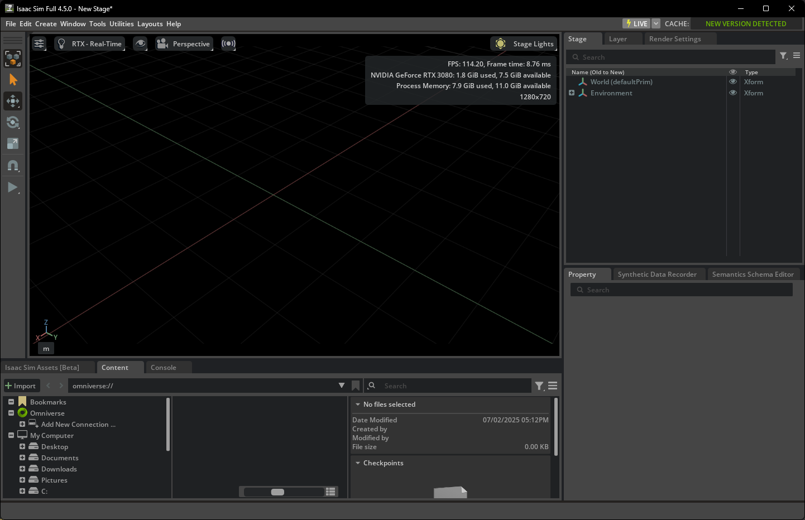
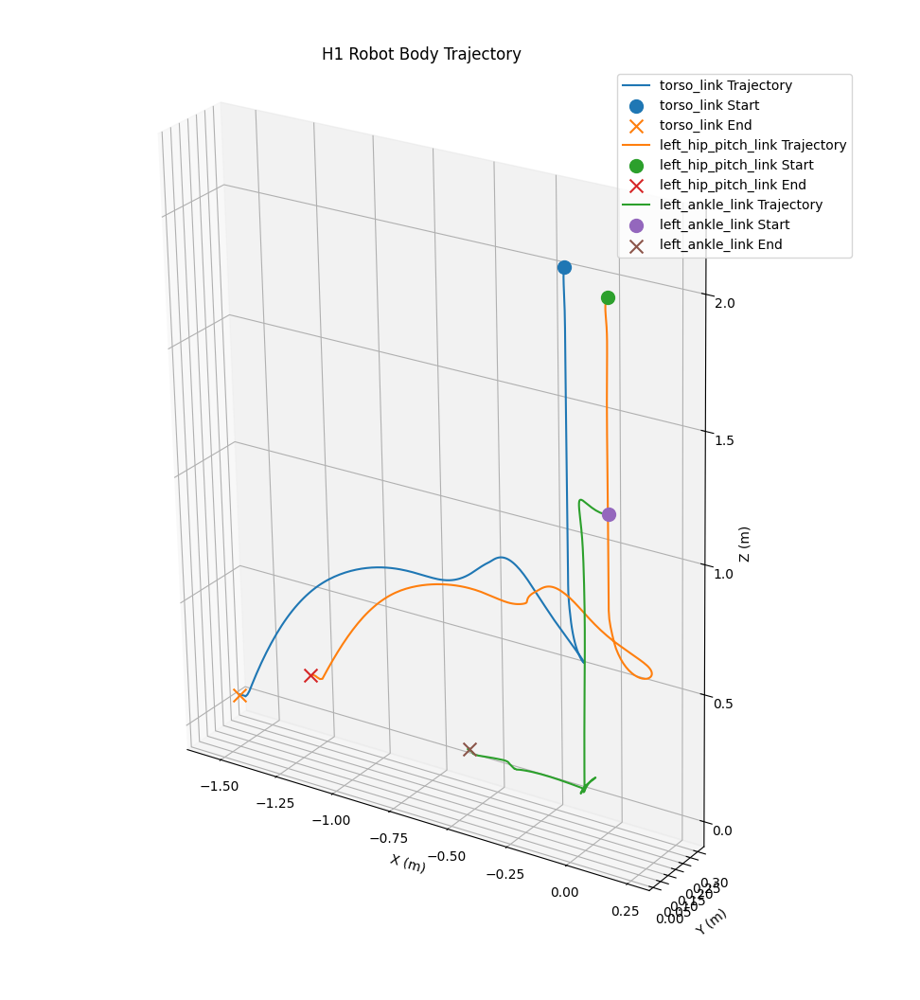

# 物理人机交互仿真

本项目旨在探索具身智能（Embodied AI）与人机交互（HOI）领域，使用NVIDIA Isaac Lab作为核心仿真与训练平台。项目从基础环境搭建开始，逐步深入到强化学习运动控制，最终目标是实现复杂的人机交互任务。

我这里让AI给我设计了一个更平滑的的学习任务清单。这个清单会结合文档的所有核心要求，并把它们安排在最符合认知规律的顺序上, 详见 [任务清单](./tasks.md)。

---

## 任务清单与项目进展

以下是本项目的学习与开发路线图，记录了各个阶段的目标和完成情况。

- **[x] 已完成**
- **[-] 部分完成 / 进行中**
- **[ ] 未开始**

### **阶段一：入门与环境搭建 (Familiarization & Setup)**
**目标：** 成功配置开发环境，熟悉Isaac Sim/Lab的基本操作，并能通过代码程序化地搭建和控制一个简单的仿真世界。

*   **[x] 任务 1.1: 环境与工具链安装**
    *   **实验记录:** [`assets/docs/1_Installation.md`](./assets/docs/Installation.md)
    *   **简介:** 记录了在不同平台（本地服务器、云平台、Windows）上安装Isaac Sim与Isaac Lab的过程，以及遇到的问题和解决方案。
    *   **成果展示:**
        

          
           
          <em>Windows平台成功启动Isaac Sim</em>
        

*   **[x] 任务 1.2: 探索仿真世界 (GUI手动操作)**
    *   **实验记录:** [`assets/docs/2_Env_Create_And_Test.md`](./assets/docs/Env_Create_And_Test.md)
    *   **简介:** 通过GUI手动创建了包含平台、障碍物、斜坡的基础场景，并添加了H1机器人、光源和物理材质。
    *   **成果展示:**
        

            <video controls src="./assets/docs/images/Env_create&test/QQ202572-222923.mp4" width="600"></video>
             
            <em>手动搭建的场景运行测试 （./assets/docs/images/Env_create&test/QQ202572-222923.mp4) </em>
        

*   **[x] 任务 1.3: 脚本化你的第一个世界 (Python API 编程)**
    *   **实验记录:** [`assets/docs/3_API_Motion_Control.md`](./assets/docs/API_Motion_Control.md)
    *   **相关代码:** [`src/python_api/move_unitree.py`](./src/python_api/move_unitree.py)
    *   **简介:** 使用Isaac Lab的Python API，以编程方式创建了H1机器人环境，并实现了一个简单的PD控制器，驱动机器人完成站立动作。同时记录并可视化了关节角度和运动轨迹。
    *   **成果展示:**
        

          
          <video controls src="./assets/docs/images/API_motion_control/Isaac Sim 4.5.0 2025-07-03 16-46-43.mp4" width="600"></video>
           
          <em>机器人运动控制及数据可视化 （./assets/docs/images/API_motion_control/Isaac Sim 4.5.0 2025-07-03 16-46-43.mp4)</em>
        

---
### **阶段二：强化学习基础与简单运动 (RL Basics & Locomotion)**
**目标：** 理解并运行Isaac Lab的强化学习框架，让机器人在简单的环境中学会一个基本技能——走路。

*   **[x] 任务 2.1: 运行并理解官方行走示例**
    *   **实验记录:** [`assets/docs/4_Humanoid_Direct.md`](./assets/docs/Humanoid_Direct.md)
    *   **简介:** 成功运行了Isaac Lab官方的`Isaac-Humanoid-Direct-v0`任务，并深入解析了其环境配置、奖励函数和核心参数。
    *   **相关代码:**
        *   Humanoid环境配置与实验记录&权重: `src/humanoid`
    *   **成果展示:**
        

            <video controls src="./assets/docs/images/Hunamoid_direct/Isaac Sim 4.5.0 2025-07-02 19-55-27.mp4" width="600"></video>
             
            <em>官方Humanoid模型行走训练（80个epoch）（./assets/docs/images/Hunamoid_direct/Isaac Sim 4.5.0 2025-07-02 19-55-27.mp4)</em>
        

*   **[x] 任务 2.2: 复现并微调宇树 H1 行走**
    *   **实验记录(IsaacGym):** [`assets/docs/5_Unitree_RL_Gym.md`](./assets/docs/Unitree_RL_Gym.md)
    *   **相关代码:**
        *   Unitree RL Gym复现: `src/unitree_rl/`
    *   **简介:** 基于官方示例，创建了针对H1机器人的新环境，并成功训练。同时，也在经典的IsaacGym+RSL-RL框架下，复现了Unitree官方的RL训练，并将结果在MuJoCo中进行了验证。
    *   **成果展示:**
        

            <video controls src="./assets/docs/images/Unitree_rl_gym/MuJoCo _ h1 scene 2025-07-04 00-29-54.mp4" width="600"></video>
             
            <em>在IsaacGym中训练，MuJoCo中验证的H1行走策略 （./assets/docs/images/Unitree_rl_gym/MuJoCo _ h1 scene 2025-07-04 00-29-54.mp4）</em>
        

---
### **阶段三：高级运动与人机交互 (Advanced Locomotion & HOI)**
**目标：** 将学习到的技能应用到更复杂的交互场景中，从简单的locomotion升级到需要与物体交互的HOI任务。

*   **[x] 任务 3.1: 探索前沿运动生成算法 (理论与代码)**
    *   **实验记录:** [`assets/docs/6_Protomotion.md`](./assets/docs/Protomotion.md)
    *   **相关代码:** `src/protomotion/` (作为子模块)
    *   **简介:** (进行中) 成功在Windows上配置并运行了`ProtoMotions`和`MaskedMimic`的预训练模型，解决了`nccl`后端的兼容性问题。目前正在深入理解其代码框架和论文思想。
    *   **成果展示:**
        

            <video controls src="./assets/docs/images/Protomotion/Isaac Sim 4.5.0 2025-07-05 01-21-35.mp4" width="600"></video>
             
            <em>成功运行MaskedMimic预训练模型 （./assets/docs/images/Protomotion/Isaac Sim 4.5.0 2025-07-05 01-21-35.mp4）</em>
        

*   **[-] 任务 3.2: 实现一个基础 HOI 任务：推箱子**
    *   **实验记录:** [`assets/docs/Protomotion_HOI.md`](./assets/docs/Protomotion_HOI.md) 
    *   **相关代码:**
        *   个人fork仓库： `https://github.com/hasaki321/25HOI_ProtoMotions.git`
        *   环境定义: `src/protomotion/protomotions/envs/box/env.py`
        *   配置文件: `src/protomotion/protomotions/config/exp/box_mlp.yaml`
    *   **简介:** (进行中) 基于`ProtoMotions`的框架，设计了一个两阶段的“推箱子”任务。目前已完成环境`PushBoxEnv`的代码编写和Hydra配置文件的创建，正在进行训练与调试。

---
### **阶段四：真实数据驱动与自主项目 (Data-Driven Methods & Capstone Project)**
**目标：** 学习使用大规模人体运动数据集来生成更逼真、更复杂的交互动作，并最终独立完成一个完整的HOI任务。

*   **[ ] 任务 4.1: 运动数据处理与应用**
*   **[ ] 任务 4.2: 基于模仿学习的 HOI 任务**
