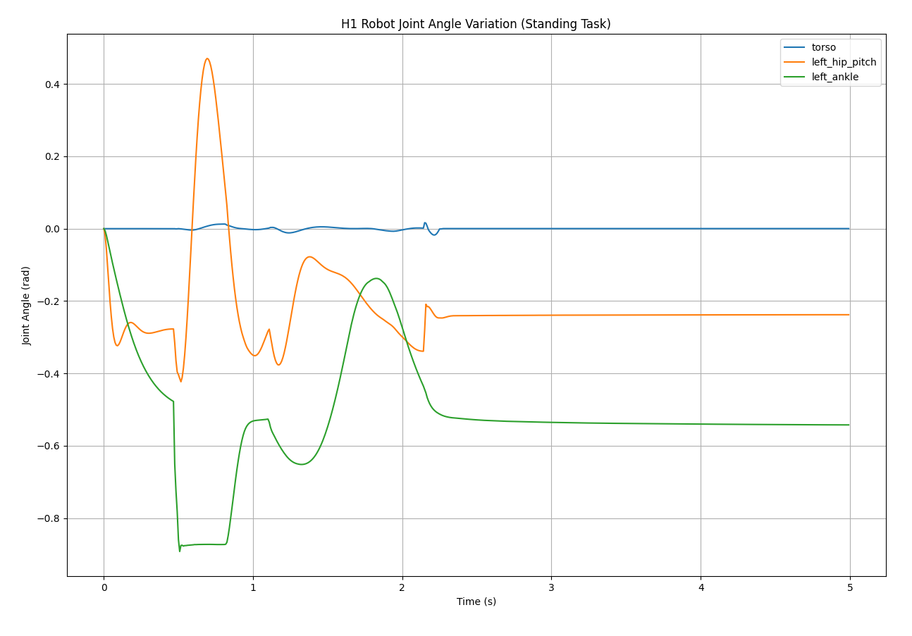
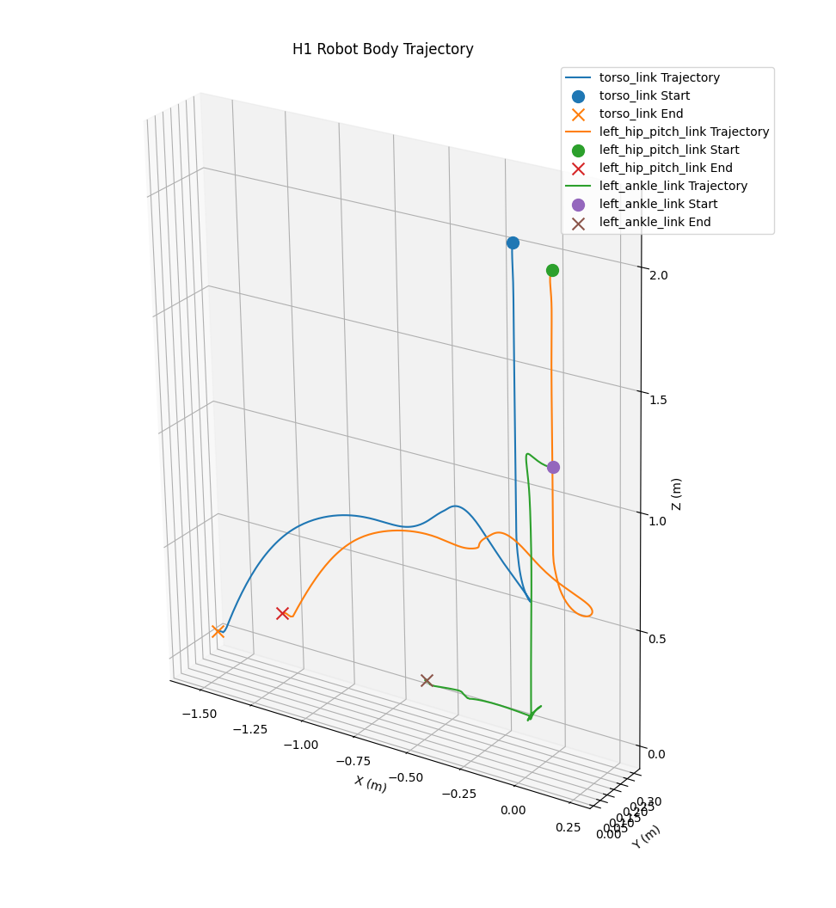

## Python API 交互

本节我们将尝试调用 IsaacLab 的 python api 尝试与 IsaacSim 直接进行交互而非使用图形化GUI，参考以下教程：
- 官网教程 https://isaac-sim.github.io/IsaacLab/main/source/tutorials/index.html
- 中文译版 https://docs.robotsfan.com/isaaclab/source/tutorials/index.html

### 从python启动一个模拟场景的基本组件 (来自官方教程 [create_empty](https://docs.robotsfan.com/isaaclab/source/tutorials/00_sim/create_empty.html))

#### 启动模拟器 

使用独立的 Python 脚本时的第一步是启动模拟应用程序。这是必要的，因为只有在模拟应用程序运行后，Isaac Sim 的各种依赖模块才可用。

```
import argparse

from isaaclab.app import AppLauncher

# create argparser
parser = argparse.ArgumentParser(description="Tutorial on creating an empty stage.")
# append AppLauncher cli args
AppLauncher.add_app_launcher_args(parser)
# parse the arguments
args_cli = parser.parse_args()
# launch omniverse app
app_launcher = AppLauncher(args_cli)
simulation_app = app_launcher.app
```

#### 导入 python 模块
一旦模拟应用程序运行，就可以从 Isaac Sim 和其他库中导入不同的 Python 模块。

```
from isaaclab.sim import SimulationCfg, SimulationContext
```

**注意**:在没有实例化 app_launcher 之前，我们无法从isaaclab.sim导入任何东西，会引发 import error！

#### 配置模拟上下文
当从独立脚本启动模拟器时，用户可以完全控制播放、暂停和步进模拟器。所有这些操作都通过 `模拟上下文` 处理。它负责各种时间轴事件，并为模拟器配置 物理场景 。
```
# Initialize the simulation context
sim_cfg = SimulationCfg(dt=0.01)
sim = SimulationContext(sim_cfg)
# Set main camera
sim.set_camera_view([2.5, 2.5, 2.5], [0.0, 0.0, 0.0])
```

### 在场景中生成基本物体 （来自官方教程 [spawn_prims](https://docs.robotsfan.com/isaaclab/source/tutorials/00_sim/spawn_prims.html)）
Omniverse中的场景设计是建立在名为USD(Universal Scene Description)的软件系统和文件格式周围的。它允许以层次结构方式描述3D场景，类似于文件系统。

USD基本概念：
- 基本形状(Prims): 这些是USD场景的基本构建块。它们可以被视为场景图中的节点。每个节点可以是网格、光源、相机或变换。它也可以是其下其他基本物体的组。
- 属性: 这些是基本物体的属性。可以将它们看作是键-值对。例如，一个基本物体可以有一个名为 color 的属性，其值为 red 。
- 关系: 这些是基本物体之间的连接。可以将它们视为指向其他基体的指针。例如，一个网格基本体可以与一个用于着色的材质基本体建立关系。

导入必要组件：
```python
import isaacsim.core.utils.prims as prim_utils
import isaaclab.sim as sim_utils
```
一般工作流程：
```python
# Create a configuration class instance
cfg = MyPrimCfg()
prim_path = "/path/to/prim"
# Use the spawner function directly from the configuration class
cfg.func(prim_path, cfg, translation=[0, 0, 0], orientation=[1, 0, 0, 0], scale=[1, 1, 1])
```

生成地面示例：
```python
cfg_ground = sim_utils.GroundPlaneCfg()
cfg_ground.func("/World/defaultGroundPlane", cfg_ground)
```

导入文件：
```python
cfg = sim_utils.UsdFileCfg(usd_path=f"{ISAAC_NUCLEUS_DIR}/Props/Mounts/SeattleLabTable/table_instanceable.usd")
cfg.func("/World/Objects/Table", cfg, translation=(0.0, 0.0, 1.05))
```

###　添加新机器人（来自官方教程　[add_new_robot](https://docs.robotsfan.com/isaaclab/source/tutorials/01_assets/add_new_robot.html) ）

#### 创建机器人示例
Isaac Lab 提供了一系列 配置 类，定义了需要被克隆的 USD 的哪些部分。因为一个机器人是一个具有关节驱动的关节，我们定义了一个 ArticulationCfg 来描述机器人。

配置一个机器人所需要的配置示例：
```python
DOFBOT_CONFIG = ArticulationCfg(
    spawn=sim_utils.UsdFileCfg(
        usd_path=f"{ISAAC_NUCLEUS_DIR}/Robots/Dofbot/dofbot.usd",
        rigid_props=sim_utils.RigidBodyPropertiesCfg(
            disable_gravity=False,
            max_depenetration_velocity=5.0,
        ),
        articulation_props=sim_utils.ArticulationRootPropertiesCfg(
            enabled_self_collisions=True, solver_position_iteration_count=8, solver_velocity_iteration_count=0
        ),
    ),
    init_state=ArticulationCfg.InitialStateCfg(
        joint_pos={
            "joint1": 0.0,
            ...
        },
        pos=(0.25, -0.25, 0.0),
    ),
    actuators={
        "front_joints": ImplicitActuatorCfg(
            joint_names_expr=["joint[1-2]"],
            effort_limit_sim=100.0,
            velocity_limit_sim=100.0,
            stiffness=10000.0,
            damping=100.0,
        ),
        ...
    },
)
```
- actuators 参数是一个执行器配置的字典，并定义我们打算用智能体控制的机器人的哪些部分。
- 'rigid_props' 定义了机器人所有刚体的通用物理属性
- 'articulation_props' 定义了机器人作为整体关节体的特殊属性
- ArticulationCfg 可选地包括 init_state 参数，它定义了关节的初始状态。
- 'actuators' 定义了Dofbot的多个执行器组（执行器组（Actuator Group）就是一组具有相同物理特性和控制模式的电机（或关节）的集合。）

#### 逻辑控制示例
这里我们简要说明一下示例代码中的简单控制逻辑, 整个逻辑控制代码分为
1. 重置逻辑
2. 控制逻辑
3. 步进逻辑

```python
def run_simulator(sim: sim_utils.SimulationContext, scene: InteractiveScene):
    # 初始化仿真时间和计数器
    sim_dt = sim.get_physics_dt()
    sim_time = 0.0
    count = 0

    # 只要仿真应用没有被关闭，就一直循环
    while simulation_app.is_running():
        # --- 重置逻辑 ---
        # 每500个仿真步，重置一次所有机器人的状态
        if count % 500 == 0:
            count = 0
            # 获取机器人的默认初始状态，并加上每个环境的偏移量，确保每个环境中的机器人重置到自己的原点
            root_jetbot_state = scene["Jetbot"].data.default_root_state.clone()
            root_jetbot_state[:, :3] += scene.env_origins
            
            # 将计算好的初始状态（位姿和速度）写入到仿真中
            scene["Jetbot"].write_root_pose_to_sim(root_jetbot_state[:, :7])
            # ... (其他状态写入) ...
            
            # 重置场景的内部缓冲区
            scene.reset()
            print("[INFO]: Resetting Jetbot and Dofbot state...")

        # --- Jetbot 控制逻辑 ---
        # 简单的时序控制：前75步直行，后25步转弯
        if count % 100 < 75:
            action = torch.Tensor([[10.0, 10.0]]) # 两个轮子速度相同，直行
        else:
            action = torch.Tensor([[5.0, -5.0]]) # 两个轮子速度相反，原地转弯
        # 将速度指令发送给Jetbot
        scene["Jetbot"].set_joint_velocity_target(action)

        # --- 仿真步进 ---
        scene.write_data_to_sim() # 将所有set_..._target的指令一次性写入物理引擎
        sim.step()              # 物理引擎步进一次
        sim_time += sim_dt      # 更新仿真时间
        count += 1              # 更新计数器
        scene.update(sim_dt)    # 更新场景，读取物理引擎返回的新状态
```

另外需要注意的是，我们可以通过 `scene["key"].data.default_root_state` 获取一个机器人的根状态。在 Isaac Lab 中，一个关节型机器人（Articulation）的**根状态 (root state)** 被存储在一个 `(N, 13)` 维度的张量中。

*   **`N`**: 代表并行环境的数量 (`num_envs`)。
*   **`13`**: 代表描述一个刚体在三维空间中完整状态所需的 13 个数值。

这 13 个数值的排列顺序是固定的：

| 索引 (Index) | 范围 | 长度 | 含义 |
| :--- | :--- | :--- | :--- |
| **0, 1, 2** | `[:3]` | 3 | **位置 (Position)**: 根（root）在世界坐标系中的 `(x, y, z)` 坐标。 |
| **3, 4, 5, 6**| `[3:7]`| 4 | **姿态/朝向 (Orientation)**: 根的旋转，用四元数 `(x, y, z, w)` 表示。 |
| **7, 8, 9** | `[7:10]`| 3 | **线速度 (Linear Velocity)**: 根在世界坐标系中的 `(vx, vy, vz)` 速度。 |
| **10, 11, 12**| `[10:13]`| 3 | **角速度 (Angular Velocity)**: 根在自身坐标系中的 `(wx, wy, wz)` 旋转速度。 |

**所以，`root_jetbot_state` 是一个形状为 `(num_envs, 13)` 的 PyTorch 张量。** 每一行代表一个环境中 Jetbot 的状态，每一列代表状态的一个特定分量。

### 练习：创建并尝试移动宇树H1机器人

好的，没问题！这是一个非常好的想法，将代码和实践过程文档化是优秀工程师的必备习惯。

以下是您要求的 Markdown 说明文档。

---

### 练习：创建并尝试移动宇树H1机器人

在这里我们的目标是使用 Isaac Lab 的 Python API 来创建一个包含宇树H1机器人的仿真环境，并编写一个简单的控制脚本，让机器人从初始姿态调整到一个预设的站立姿势。我们还将记录这个过程中的关键数据，并通过2D和3D图表来可视化机器人的运动。

#### 实现思路

我们主要模仿上面官方给出的tutor来创建我们的脚本（位于 src/python_api/move_unitree.py），它主要分为三个部分：

1.  **环境初始化**: 我们使用 `AppLauncher` 来启动 Omniverse 仿真应用，并创建一个 `SimulationContext` 来管理物理世界的步进。同时，我们定义了一个 `InteractiveScene` 类，在其中配置好我们需要的地面、灯光和H1机器人,我们把这个机器人放在离地面一定高度的地方让其自然下落。

2.  **仿真与控制循环**: 这是脚本的核心。我们设置了一个持续5秒的仿真循环。在循环的每一步中，我们执行以下操作：
    - **控制**: 我们定义了一个目标站立姿势，并将这个目标位置直接发送给机器人的关节控制器。Isaac Sim 会根据我们在机器人配置（CFG）中预设的刚度（stiffness）和阻尼（damping）参数，自动计算出力矩来驱动关节运动。
        ```python
            target_joint_pos_dict = {
                ".*_hip_yaw": 0.0, ".*_hip_roll": 0.0, ".*_hip_pitch": -0.28,
                ".*_knee": 0.79, ".*_ankle": -0.52, "torso": 0.0,
                ".*_shoulder_pitch": 0.28, ".*_shoulder_roll": 0.0, ".*_shoulder_yaw": 0.0, ".*_elbow": 0.52,
            }
        ```
    - **数据采集**: 我们记录下当前时间点的关节角度 (`robot.data.joint_pos`) 和身体各个部位的空间位置 (`robot.data.body_pos_w`)。
    - **步进**: 我们驱动物理仿真向前推进一步 (`sim.step()`)。

3.  **可视化**: 仿真循环结束后，我们利用 `matplotlib` 库来处理收集到的数据。
    - 我们绘制了一张2D图表，展示了几个关键关节（躯干、髋、踝）的角度是如何随着时间变化的。
        
    - 我们还绘制了一张3D图表，将上述关节在三维空间中的运动轨迹描绘出来，让我们能直观地看到机器人的轨迹如何改变的。
        