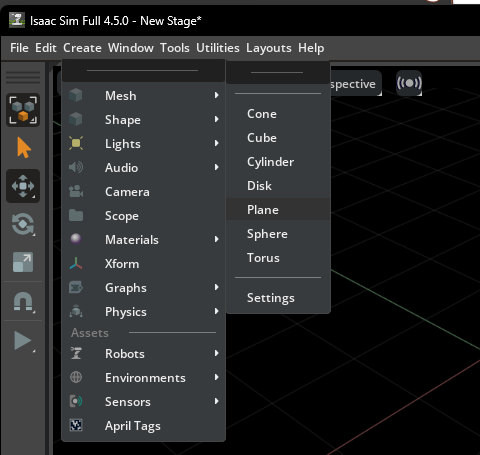
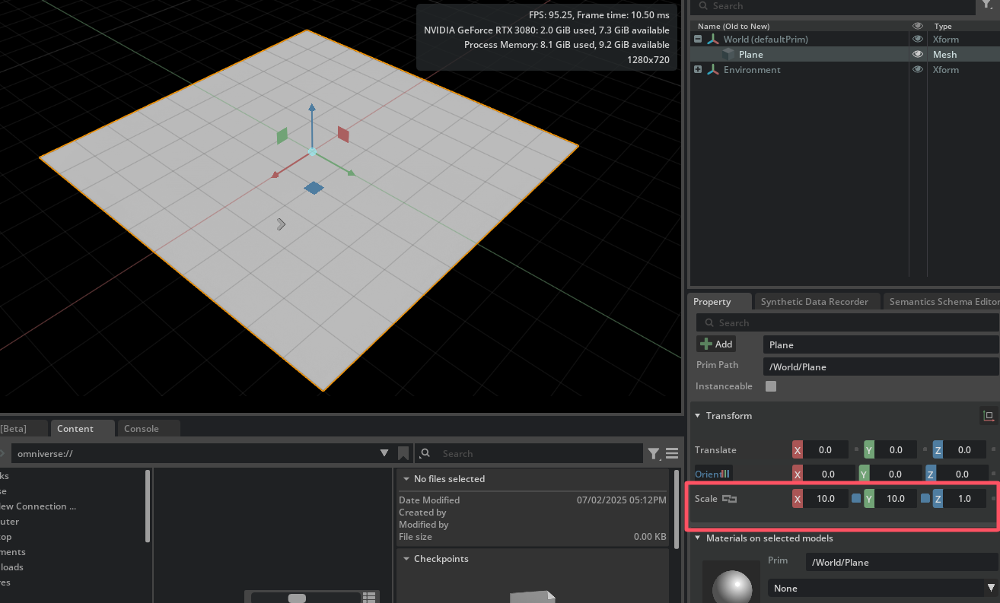
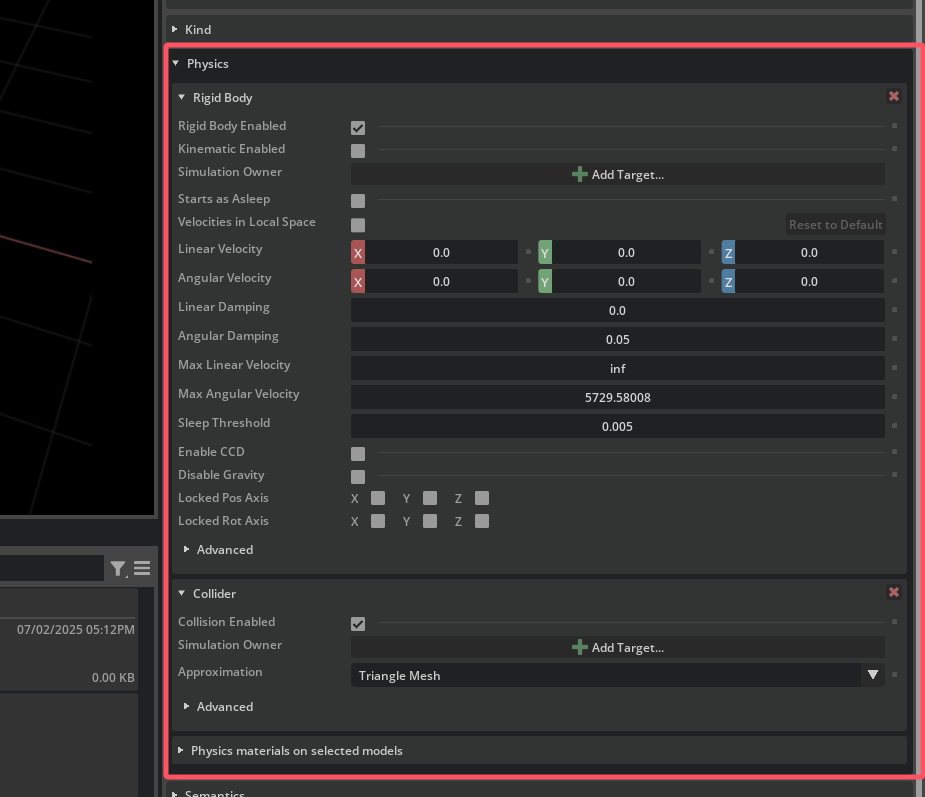
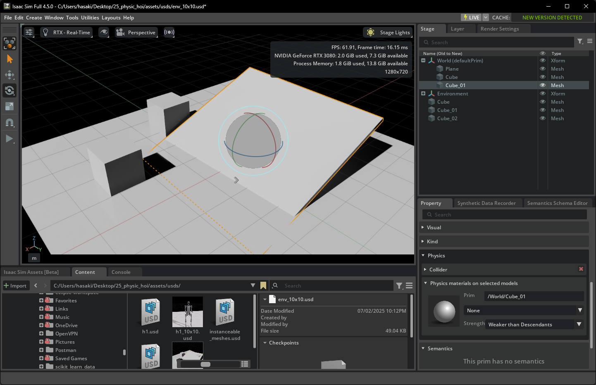
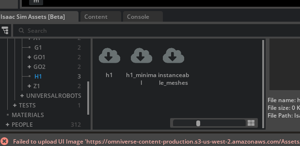
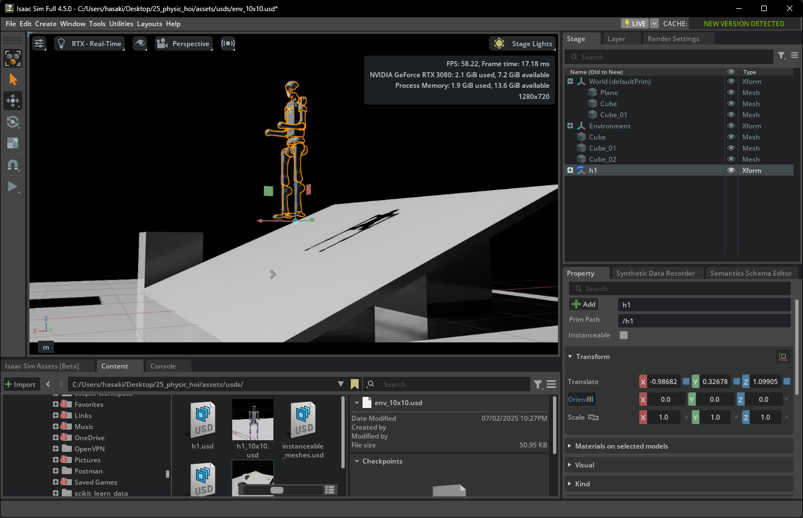
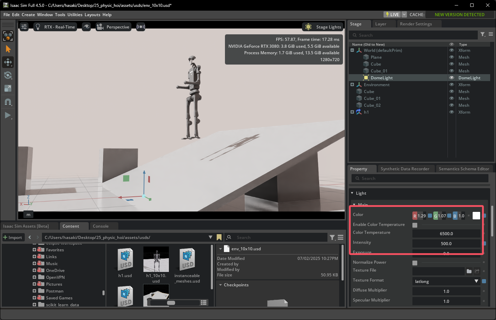
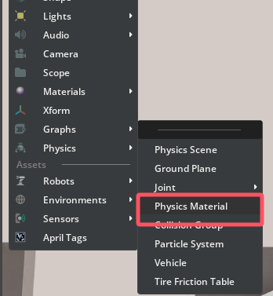
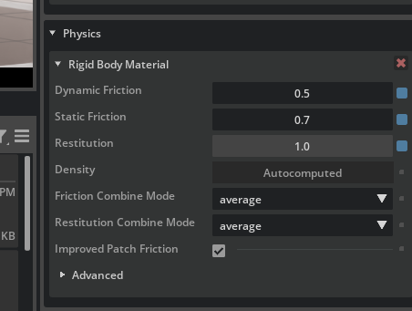
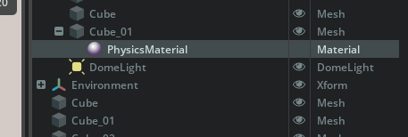

## 创建基础环境测试

### 创建一个10x10的测试平台
- 选择 Create -> Mesh -> Plane

- 并且在property中修改scale到10x10的平台大小，可以看到我们成功创建了10x10的平台：

- 添加物理特性：
  - 为了让机器人能和地面交互，选中平面，在属性窗口点击 Add -> Physics -> Collider。使其变成一个物理碰撞体。

- 添加障碍物与斜坡
  - 我们可以选择mesh中的cube或者来当做障碍物，再将其变换压平并调整角度即可让其成为斜坡
  - 同样的，对于这些新添加的物体，我们都要选择Collider与Rigid Body 使其变成碰撞体与刚体。
  - 对于斜坡我们可以选择 Transform 中的 Orient 来改变物体的旋转角，从而使一个平面变成斜坡，只选择Collider使其变成物理碰撞体可与机器人交互

最后我们导出保存现在这个场景为 `env_10x10.usd`

### 添加人形机器人
我们可以直接从左下角这个isaac sim assets获取我们想要的物品资源，但是我的windows貌似不能正确读出它的网址，因此我们直接把这个地址复制到浏览器下载：

H1：
- https://omniverse-content-production.s3-us-west-2.amazonaws.com/Assets/Isaac/4.5/Isaac/IsaacLab/Robots/Unitree/H1/h1.usd
- https://omniverse-content-production.s3-us-west-2.amazonaws.com/Assets/Isaac/4.5/Isaac/IsaacLab/Robots/Unitree/H1/instanceable_meshes.usd

我们直接将H1的usd文件拖进模拟器中，并尝试将机器人放置到我们之前创建好的场景中，并置于一定的高度中：

让我们现在来开始运行一下看看场景与机器人是否正确设置：
<video controls src="QQ202572-222923.mp4" title="Title"></video>

可以看到环境正确运行，机器人由于重力正确下落并向前倾倒。

获取其他的官方资产？我们可以参考 `isaaclab\source\isaaclab_assets\isaaclab_assets\robots` 中的py文件，其中 `{ISAACLAB_NUCLEUS_DIR}/Robots/Unitree/A1/a1.usd` 指明了usd的路径，我们只需要把 `{ISAACLAB_NUCLEUS_DIR}` 换成这个官方仓库的地址 `https://omniverse-content-production.s3-us-west-2.amazonaws.com/Assets/Isaac/4.5/Isaac/IsaacLab` 即可。

### 部署基础光源和物理材质

#### 基础光源
这里我们尝试添加环境光 (Dome Light):
在顶部菜单栏选择 Create -> Light -> Dome Light。
Dome Light 会均匀地从一个虚拟的“天穹”向场景内部投射光线，可以有效消除纯黑的阴影。并且我们将Intensity（强度）调整至 500，并且稍微调整RGB：

#### 物理材质
我们可以通过选择 Create -> Physics -> Physics Material 来创建一个物理材质，我们这里选择创建一个刚性物体的材质

核心参数:
- Dynamic Friction（动摩擦系数）：物体在运动时受到的摩擦力。
- Static Friction（静摩擦系数）：物体从静止开始运动时需要克服的摩擦力。通常比动摩擦略大。
- Restitution（恢复系数/弹性）：碰撞后能量的保留程度。0 表示完全不弹，1 表示完全反弹。

接下来我们可以直接把我们刚刚创建好的材质直接拖到物体上面即可直接应用了，比如说我们这里直接应用到斜面上：
