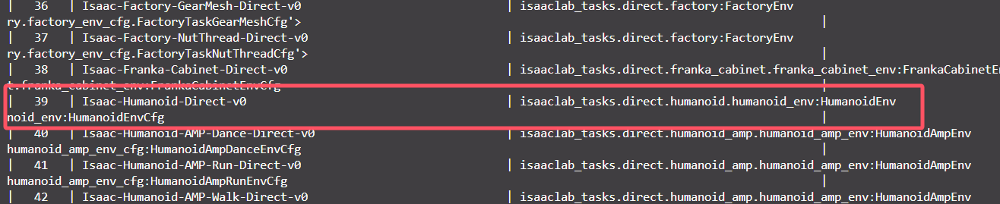
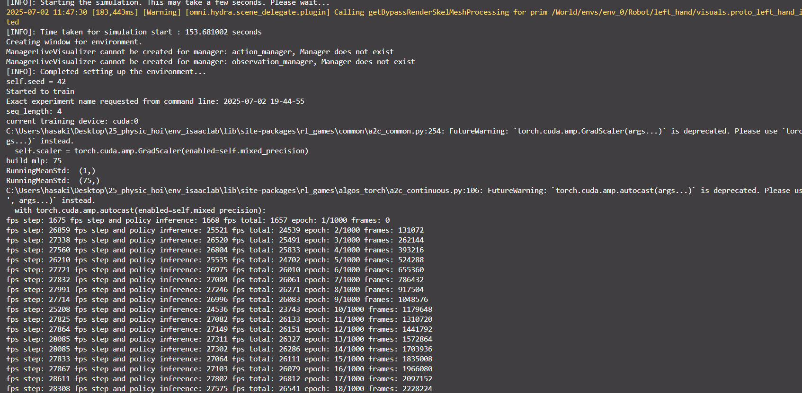
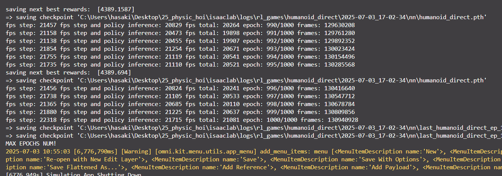

## 运动控制测试

### Simple Locomotion
我们来参考一下这个 `isaaclab/source/isaaclab_tasks/isaaclab_tasks/direct/humanoid/humanoid_env.py` 来先尝试运行一下简单用例，并理解一个 RL 任务在 Isaac Lab 中是如何被组织和定义的。

#### humanoid_env解析：

---

##### 注册信息
- 首先我们可以在这个 `__init__.py` 的入口函数处找到我们这个任务的注册名和各种信息：
  ```py
  gym.register(
      id="Isaac-Humanoid-Direct-v0",
      entry_point=f"{__name__}.humanoid_env:HumanoidEnv",
      disable_env_checker=True,
      kwargs={
          "env_cfg_entry_point": f"{__name__}.humanoid_env:HumanoidEnvCfg",
          "rl_games_cfg_entry_point": f"{agents.__name__}:rl_games_ppo_cfg.yaml",
          "rsl_rl_cfg_entry_point": f"{agents.__name__}.rsl_rl_ppo_cfg:HumanoidPPORunnerCfg",
          "skrl_cfg_entry_point": f"{agents.__name__}:skrl_ppo_cfg.yaml",
      },
  )
  ```
  这里的 `Isaac-Direct-Humanoid-v0` 就是我们要用的任务名， 我们接下来会以这个任务名来启动我们的训练任务。

##### 配置参数解析
`humanoid_env.py` 中的重要配置参数解析： 
- 一、场景（Scene）参数

    这部分定义了如何组织多个并行的仿真环境。

    *   `scene: InteractiveSceneCfg(...)`:
        *   `num_envs=4096`: **关键性能参数**。同时运行 4096 个并行的仿真环境。这是 Isaac Lab 能实现高效训练的核心。
        *   `env_spacing=4.0`: 每个环境在世界坐标系中的间距是4米，防止不同环境里的机器人互相干扰。
        *   `replicate_physics=True`: **关键性能优化**。让GPU为每个环境独立且并行地计算物理，而不是在一个大场景里串行计算。

- 二、机器人（Robot）和奖励（Reward）相关参数

    这部分是**算法和行为调优的核心**，也是我们后续做实验时最常修改的地方。

    *   `robot: ArticulationCfg = HUMANOID_CFG.replace(...)`:
        *   **含义**: 指定机器人模型。它使用了预定义的 `HUMANOID_CFG`，并通过 `.replace()` 方法修改了它的 `prim_path`，使其能匹配所有并行环境中的机器人（`env_.*` 是通配符）。

    *   `joint_gears: list = [...]`:
        *   **含义**: 每个关节的齿轮比列表。
        *   **作用**: 这在物理上影响着电机输出的力矩如何转化为关节的实际力矩。通常由机器人制造商提供，一般不需要修改。

    - **奖励与惩罚的权重（Weights & Scales）**

      这些参数是**奖励函数**的“旋钮”。通过调整它们，我们可以告诉机器人什么行为更重要。

      *   `heading_weight: float = 0.5`:
          *   **含义**: “朝向”奖励的权重。用于计算“朝向目标方向”的奖励。值越大，机器人越倾向于朝着指定的方向前进。
      *   `up_weight: float = 0.1`:
          *   **含义**: “身体垂直”奖励的权重。值越大，机器人越倾向于保持身体（通常是Z轴）竖直向上。

      *   `energy_cost_scale: float = 0.05`:
          *   **含义**: 能量消耗惩罚的缩放系数。这个惩罚项通常与力矩和速度的平方成正比，模拟真实的能量消耗。值越大，机器人越倾向于用“节能”的方式运动。
      *   `actions_cost_scale: float = 0.01`:
          *   **含义**: 动作惩罚的缩放系数。惩罚过大的动作指令（即力矩）。值越大，机器人动作越“温柔”。
      *   `alive_reward_scale: float = 2.0`:
          *   **含义**: “存活”奖励的缩放系数。只要机器人没有摔倒，在每个时间步都会获得一个固定的正奖励。值越大，机器人越有动力“活下去”。
      *   `dof_vel_scale: float = 0.1`:
          *   **含义**: 关节速度惩罚的缩放系数。惩罚过快的关节运动。值越大，机器人动作越平缓。

    - **终止与惩罚（Termination & Cost）**

      *   `death_cost: float = -1.0`:
          *   **含义**: “死亡”惩罚。当机器人摔倒时，会受到一个很大的负奖励。这给了它一个强烈的信号：“不要摔倒！”。
      *   `termination_height: float = 0.8`:
          *   **含义**: 终止高度。当机器人躯干的质心高度低于0.8米时，就判断为摔倒（死亡）。

    - **观测值缩放（Observation Scales）**

      这些参数用于将原始的物理观测值（可能范围很大）归一化到RL算法更喜欢的范围（如 `[-1, 1]`），有助于训练稳定。

      *   `angular_velocity_scale: float = 0.25`:
          *   **含义**: 角速度观测值的缩放系数。真实的角速度可能是很大的数值，乘以0.25把它缩小。
      *   `contact_force_scale: float = 0.01`:
          *   **含义**: 接触力观测值的缩放系数。脚底接触地面的力可能非常大，需要大幅缩小。

---

如何启动？

我们可以通过 `./isaaclab.bat` 脚本来查看我们当前环境下可用的所有训练任务， 它同时也包含了 `isaaclab_tasks` 下的所有训练场景和设置；
```ps1
./isaaclab.bat -p scripts/environments/list_envs.py
```
可以看到我们希望运行的环境在这里




同时我们可以指定使用哪个强化学习库来运行我们的环境，官方提供了以下几种不同的强化学习库

We provide wrappers to different reinforcement libraries. These wrappers convert the data from the environments into the respective libraries function argument and return types.
- RL-Games
- RSL-RL
- SKRL
- Stable-Baselines3

我们这里以大家最常用的 rlgames 作为示例：

```
./isaaclab.bat -p scripts/reinforcement_learning/rl_games/train.py --task Isaac-Humanoid-Direct-v0 --headless
```

成功运行环境：



80 epoch 示例：

<video controls src="Isaac Sim 4.5.0 2025-07-02 19-55-27.mp4" title="Title"></video>

### 训练 宇树 H1
教程：
https://docs.robotsfan.com/isaaclab/source/tutorials/03_envs/modify_direct_rl_env.html

我们将对直接工作流程中的人形任务进行轻微修改，将简单的人形模型更改为 Unitree H1 人形机器人，而不影响原始代码。


#### 复制文件并注册新任务
为了避免修改现有任务的代码，我们将复制包含Python代码的文件，并对该副本进行修改。然后，在Isaac Lab项目 `source/isaaclab_tasks/isaaclab_tasks/direct/humanoid` 文件夹中，我们将复制 `humanoid_env.py` 文件并将其重命名为 `h1_env.py` 。

在代码编辑器中打开 `h1_env.py` 文件，并将所有人形任务名称（ HumanoidEnv ）及其配置（ HumanoidEnvCfg ）实例分别替换为 H1Env 和 H1EnvCfg 。这是为了在注册环境时避免名称冲突而必要的。

一旦更改名称完成，我们就开始在名称为 Isaac-H1-Direct-v0 的任务下添加新条目。为此，我们修改同一工作文件夹中的 `__init__.py` 文件，并添加以下条目。有关环境注册的更多详细信息，请参考 注册环境 教程。

```python
from .h1_env import H1Env, H1EnvCfg
gym.register(
    id="Isaac-H1-Direct-v0",
    entry_point="isaaclab_tasks.direct.humanoid:H1Env",
    disable_env_checker=True,
    kwargs={
        "env_cfg_entry_point": H1EnvCfg,
        "rl_games_cfg_entry_point": f"{agents.__name__}:rl_games_ppo_cfg.yaml",
        "rsl_rl_cfg_entry_point": f"{agents.__name__}.rsl_rl_ppo_cfg:HumanoidPPORunnerCfg",
        "skrl_cfg_entry_point": f"{agents.__name__}:skrl_ppo_cfg.yaml",
    },
)
```

#### 改变机器人
H1EnvCfg 类（在新创建的 `h1_env.py` 文件中）封装了环境的配置值，包括要实例化的资产。特别是在这个例子中， robot 属性保存着目标关节配置。

由于 Unitree H1 机器人包含在 Isaac Lab 资产扩展 (isaaclab_assets) 中，我们可以直接导入并进行替换 (在 H1EnvCfg.robot 属性下)，如下所示。请注意，我们还需要修改 joint_gears 属性，因为它包含特定于机器人的配置值。
```python
from isaaclab_assets import H1_CFG
robot: ArticulationCfg = H1_CFG.replace(prim_path="/World/envs/env_.*/Robot")
joint_gears: list = [
    50.0,  # left_hip_yaw
    50.0,  # right_hip_yaw
    50.0,  # torso
    50.0,  # left_hip_roll
    50.0,  # right_hip_roll
    50.0,  # left_shoulder_pitch
    50.0,  # right_shoulder_pitch
    50.0,  # left_hip_pitch
    50.0,  # right_hip_pitch
    50.0,  # left_shoulder_roll
    50.0,  # right_shoulder_roll
    50.0,  # left_knee
    50.0,  # right_knee
    50.0,  # left_shoulder_yaw
    50.0,  # right_shoulder_yaw
    50.0,  # left_ankle
    50.0,  # right_ankle
    50.0,  # left_elbow
    50.0,  # right_elbow
]
```
机器人发生了变化，因此控制的关节数量或构成关节的刚体数量也发生了变化，例如。因此，还需要调整环境配置中的其他值，这些值依赖于机器人的特性，例如观察和动作空间中的元素数量。

```python
action_space = 19
observation_space = 69
```

####　代码执行
完成了轻微修改之后，类似于之前的教程，我们可以使用其中一个可用的强化学习工作流来对该任务进行训练。
```ps1
cd isaaclab
./isaaclab.bat -p scripts/reinforcement_learning/rl_games/train.py --task Isaac-H1-Direct-v0
```

当训练完成时，我们可以使用以下命令可视化结果。要停止仿真，您可以关闭窗口，或者在启动仿真的终端中按下 Ctrl+C 。
```ps1
./isaaclab.bat -p scripts/reinforcement_learning/rl_games/play.py --task Isaac-H1-Direct-v0 --num_envs 64
```

权重与日志位于 `src\humanoid\logs`, 最佳reward 值：


