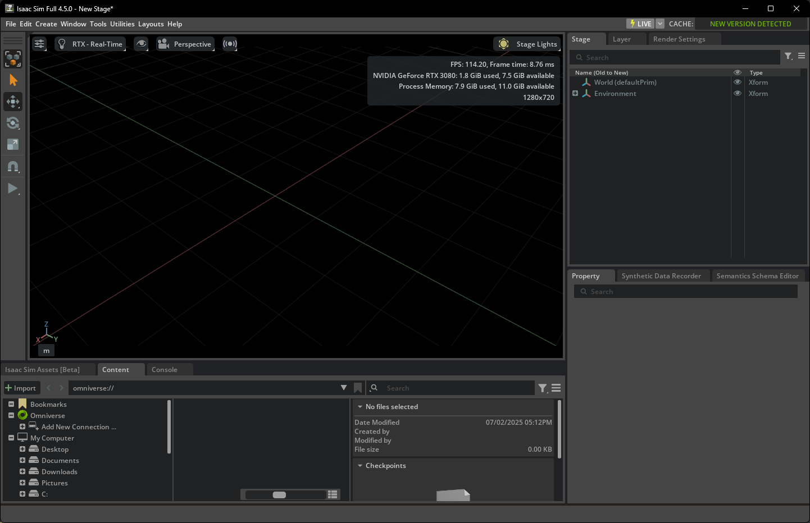

### **实验记录：开发环境安装与配置**

#### **1. 目标与背景**

我们的首要任务是搭建用于具身智能研究的仿真开发环境。核心工具是 NVIDIA Isaac Sim 及其配套的强化学习框架 Isaac Lab。Isaac Sim 是一个基于 Omniverse 平台的强大机器人仿真器，它利用了 NVIDIA 的硬件加速能力，为机器人学习提供了逼真的物理模拟和渲染效果。

- **Isaac Sim 文档:**
    - Isaac Lab 主页: https://isaac-sim.github.io/IsaacLab/main/index.html
    - Isaac Lab Pip 安装指南: https://docs.robotsfan.com/isaaclab/source/setup/installation/pip_installation.html
    - Isaac Sim WebRTC 远程访问: https://docs.isaacsim.omniverse.nvidia.com/4.5.0/installation/manual_livestream_clients.html
- **Omniverse & API 文档:**
    - Omniverse 平台文档: https://docs.omniverse.nvidia.com/
    - Isaac Sim API 参考: https://docs.omniverse.nvidia.com/py/isaacsim/index.html

#### **2. 安装过程与问题解决**

我们在多个平台上进行了安装尝试，包括本地服务器、云平台和 Windows。

**实验环境:**
- **本地服务器:** Ubuntu 22.04, Ryzen R5 5500, 16GB RAM, NVIDIA Tesla P100 (16GB VRAM)
- **云平台:** 兰州大学超算中心云平台
- **个人电脑:** Windows 系统

**2.1 初次尝试：源码编译 (官方Pip源失效)**

起初，我们发现官方的 pip 源 `https://pypi.nvidia.com/isaacsim/` 无法访问。因此，我们转向了从 Git 仓库直接编译 Isaac Sim 的方案。

```bash
# 1. 创建并激活Conda环境
conda create -p ./env_isaaclab python=3.10
conda activate ./env_isaaclab

# 2. 安装Pytorch
pip install torch==2.5.1 torchvision==0.20.1

# 3. 克隆并编译 Isaac Sim
git clone https://github.com/isaac-sim/IsaacSim.git isaacsim
cd isaacsim
git lfs install
git lfs pull
./build.sh

# 4. 克隆并配置 Isaac Lab
git clone -b feature/isaacsim_5_0 https://github.com/isaac-sim/IsaacLab.git isaaclab
cd isaaclab
ln -s ../isaacsim/_build/linux-x86_64/release _isaac_sim
./isaaclab.sh -i
```
在尝试运行官方强化学习示例时，我们遇到了报错，如下图所示，初步判断可能与环境或驱动有关。


**2.2 再次尝试：官方Pip源恢复**

后续我们发现官方 Pip 源恢复了正常，于是我们采用了更便捷的 Pip 安装方式。

```bash
# 1. 创建并激活Conda环境
conda create -p ./env_isaaclab python=3.10 -y
conda activate ./env_isaaclab

# 2. 安装Pytorch (指定CUDA版本)
pip install torch==2.5.1 torchvision==0.20.1 --index-url https://download.pytorch.org/whl/cu118

# 3. 通过Pip安装Isaac Sim
pip install 'isaacsim[all,extscache]==4.5.0' --extra-index-url https://pypi.nvidia.com
```
然而，使用这种方法后，在运行示例时我们依然遇到了类似的错误。


**2.3 云平台部署**

考虑到本地环境的复杂性，我们转向了配置更标准的云平台。我们使用了兰州大学超算中心的云服务器，并重复了上述 Pip 安装步骤。由于云平台不直接开放端口，我们利用 FRP (https://github.com/fatedier/frp) 将仿真环境的 WebRTC 流转发到公网服务器，以便远程查看仿真界面。

这次，在运行官方教程示例时，我们成功了。下图显示了仿真正常运行的截图。


**2.4 Windows 平台安装**

我们也在 Windows 系统上进行了尝试。安装步骤与 Pip 方式基本一致。一个关键的额外步骤是需要启用长路径支持，以避免在安装过程中出现文件路径过长的问题。

```powershell
# 在管理员模式下运行PowerShell以启用长路径
New-ItemProperty -Path "HKLM:\SYSTEM\CurrentControlSet\Control\FileSystem" -Name "LongPathsEnabled" -Value 1 -PropertyType DWORD -Force
```
安装完成后，我们成功启动了 Isaac Sim，并加载了场景。



初始化 Isaac Lab 环境也顺利完成。
```powershell
cd isaaclab
.\isaaclab.bat -i
```
至此，我们已在多个平台上成功配置了所需的开发环境。