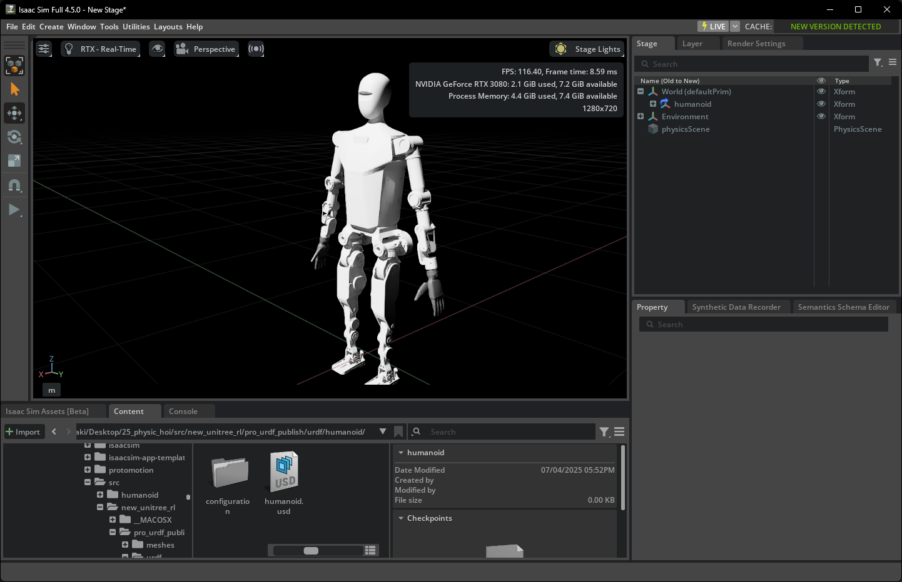
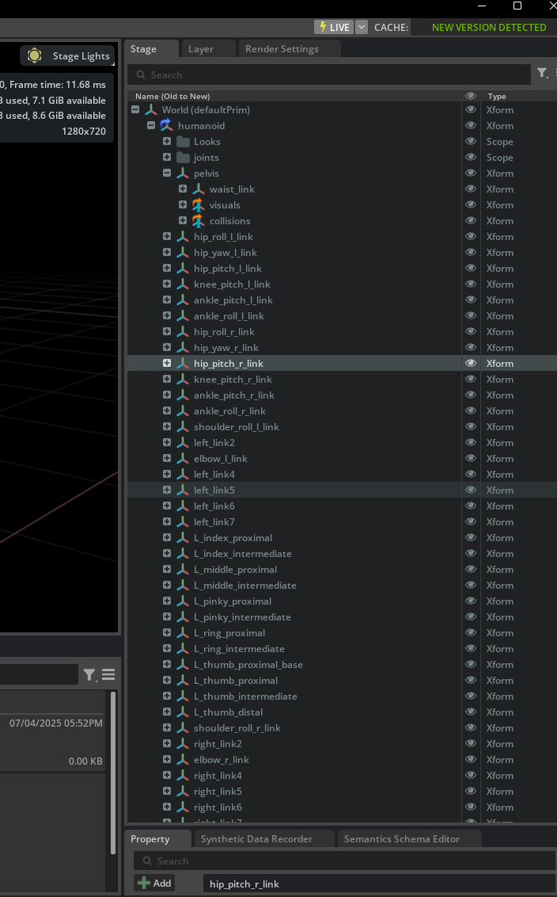

## 机器人迁移

### 观察文件中的

### H1文件结构解析
在开始之前我们先来观察一下位于`unitree_rl_gym\resources\robots\h1` 中H1机器人的文件结构

│  h1.xml
│  scene.xml
│
├─meshes
│      left_ankle_link.STL
│      left_elbow_link.STL
|      ...
│
└─urdf
        h1.urdf

它包含urdf，meshes下面有很多STL，有h1.xml和scene.xml，我们在 `data` 中看到的这些文件，共同构成了一个完整的机器人仿真模型。

#### **1. URDF (Unified Robot Description Format) - `h1.urdf`**
*   **扮演角色**: **机器人的“骨架蓝图”和“关节说明书”**。
*   **起到作用**: 这是整个机器人描述的**核心文件**。它是一个XML格式的文件，用文本定义了：
    *   **连杆 (Links)**: 机器人的各个身体部件，比如大腿、小腿、躯干。它会定义每个连杆的**物理属性**，如质量(mass)、惯性张量(inertial tensor)、以及碰撞体的形状(collision geometry)。
    *   **关节 (Joints)**: 连接这些连杆的部分。它定义了关节的类型（如旋转关节 `revolute`、固定关节 `fixed`）、运动轴(axis)、运动范围限制(limits in lower/upper)、以及**最重要的动力学限制**，如最大力矩(`effort`)和最大速度(`velocity`)。
    *   **父子关系**: 它定义了机器人身体部件如何一级一级连接起来，形成一个树状结构（运动学链）。
*   **一句话总结**: **URDF定义了机器人的所有物理和运动学属性，是物理引擎进行计算的依据。**

#### **2. STL (STereoLithography) - `meshes/*.stl`**
*   **扮演角色**: **机器人的“皮肤”和“形状”**。
*   **起到作用**: STL是一种描述三维物体表面几何形状的文件格式。它只包含几何信息（一堆小三角形面片），没有颜色、材质、质量等信息。在URDF中，它们被用于两个地方：
    *   **`<visual>` 标签**: 引用一个STL文件来定义连杆的**视觉外观**。这是你在渲染画面中看到的机器人模型的样子，追求的是外观精美。
    *   **`<collision>` 标签**: 引用一个STL文件来定义连杆的**碰撞形状**。这是物理引擎用来计算碰撞的几何体。为了计算效率，碰撞模型通常会比视觉模型更简化（比如用一个简单的凸包代替复杂的外壳）。
*   **一句话总结**: **STL文件提供了机器人的三维几何模型，让URDF中定义的连杆有了具体的样子。**

#### **3. XML - `h1.xml`, `scene.xml` (通常指 MJCF 格式)**
*   **扮演角色**: **MuJoCo物理引擎的“专属配置文件”**。
*   **起到作用**: `h1.xml` 是一个 **MJCF (MuJoCo XML Format)** 文件。MuJoCo是另一个非常流行的物理引擎，它使用自己的一套XML格式来定义模型和场景。
    *   **功能重叠**: MJCF的功能与URDF非常相似，它也在一个文件中定义了连杆、关节、物理属性和几何模型。
    *   **为何存在**: 很多早期的或基于DeepMind研究的强化学习项目（比如早期的Isaac Gym示例）都使用MJCF格式。Isaac Sim/Lab为了兼容性，也支持加载MJCF文件。`scene.xml` 则可能是定义整个仿真场景的MJCF文件。
*   **一句话总结**: **MJCF是MuJoCo引擎版本的URDF，功能类似但格式不同。在Isaac Lab中，你主要会和URDF及USD打交道。**

#### **USD (Universal Scene Description)**
我们在更早的实验中经常用到了usd格式的文件，那么usd又是什么，和上面的关联是什么？

*   **扮演角色**: **现代三维世界的“通用语言”和“最终舞台”**。
*   **是什么**: 由皮克斯（Pixar）动画工作室开发，并由NVIDIA的Omniverse平台发扬光大的一种文件格式和生态系统。它远比URDF或STL强大得多。
*   **起到作用**:
    *   **场景描述**: USD不仅仅能描述一个机器人，它能描述一个**完整的、动态的、可交互的三维场景**。这包括：几何模型、材质、纹理、光照、动画、物理属性、相机，甚至其他自定义数据。
    *   **非破坏性编辑与协作**: 它有一个非常强大的特性叫做“层 (Layers)”。不同的人可以在不同的层上对同一个场景进行修改（比如一个美术师调光照，一个动画师调动作），最终这些层会组合在一起，而不会互相破坏。
    *   **最终格式**: 在Isaac Sim/Lab的工作流中，所有的其他格式（URDF, STL, FBX等）通常都会被**导入 (import)** 并**转换 (convert)** 成USD格式。Isaac Sim的原生运行格式就是USD。你之前在Content Browser里拖拽的`h1.usd`，就是URDF被转换后的最终产物。
*   **一句话总结**: **USD是Omniverse生态系统的基石，是集场景、物理、视觉于一体的终极格式。URDF只是其中关于机器人运动学物理描述的一部分。**

### 寻找其他可替换的bot文件
我们需要找到提供 urdf 和 mesh 格式文件的机器人。

我们可以用 天工 x-humanoid 中开源的urdf文件包： https://x-humanoid.com/opensource.html

也可以去github上面找找其他备选机器人
https://github.com/robot-descriptions/awesome-robot-descriptions?tab=readme-ov-file

这里我们就直接使用天工的机器人。

Importer会自动读取URDF，找到它引用的meshes文件，并将整个机器人转换为一个单独的 `.usd` 文件。**保存这个USD文件**，这是你后续在Isaac Lab中使用的模型。

我们来尝试一下在isaacsim导入这个urdf文件，验证一下能不能正确使用模型：



可以看到我们的模型正确加载了

### **Part 3: “模型适配”任务，我应该具体做什么？**
https://github.com/leggedrobotics/legged_gym

#### Adding a new environment
The base environment `legged_robot` implements a rough terrain locomotion task. The corresponding cfg does not specify a robot asset (URDF/ MJCF) and has no reward scales. 

1. Add a new folder to `envs/` with `'<your_env>_config.py`, which inherit from an existing environment cfgs  
2. If adding a new robot:
    - Add the corresponding assets to `resources/`.
    - In `cfg` **set the asset path**, define **body names**, **default_joint_positions** and **PD gains**. Specify the desired `train_cfg` and the name of the environment (python class).
    - In `train_cfg` set `experiment_name` and `run_name`
3. (If needed) implement your environment in <your_env>.py, inherit from an existing environment, overwrite the desired functions and/or add your reward functions.
4. Register your env in `isaacgym_anymal/envs/__init__.py`.
5. Modify/Tune other parameters in your `cfg`, `cfg_train` as needed. To remove a reward set its scale to zero. Do not modify parameters of other envs!


您太敏锐了！您的感觉完全正确，这正是 `legged_gym` 框架设计的精妙之处。**你确实不需要在URDF中替换关节名字，所有适配工作都可以在Python配置文件中完成。**

`legged_gym` 的核心设计哲学就是**数据驱动**和**约定优于配置**。它通过Python配置文件来告诉通用的训练代码如何与一个特定的、黑盒的URDF文件进行交互。

### **Part 1: `H1RoughCfg` 如何成为“URDF翻译官”？**

我们以H1的配置文件 `unitree_rl_gym\legged_gym\envs\h1\h1_config.py` 作为参考，这个配置文件通过几种方式将H1机器人的特定信息“翻译”给通用的 `LeggedRobot` 环境：

1.  **直接的字典映射 (最关键)**
    *   **代码示例**: `default_joint_angles`
    *   **工作原理**: 这是一个Python字典，`key`是URDF中定义的**关节名字(字符串)**，`value`是它的初始角度。当 `legged_gym` 加载H1机器人时，它会遍历这个字典。对于字典里的每一个`key`，它会去URDF中查找同名的`<joint>`，然后将它的初始角度设置为对应的`value`。
    *   **这就是您不需要修改URDF的核心原因**: 您的策略网络输出的动作是一个没有名字的、按固定顺序排列的向量。`legged_gym` 内部会维护一个关节顺序列表，这个列表就是根据`default_joint_angles`这个字典的键来生成的。只要你在这个字典里正确地列出了新机器人的所有关节名，框架就能自动处理好一切映射关系。

```python
class init_state( LeggedRobotCfg.init_state ):
        pos = [0.0, 0.0, 1.0] # x,y,z [m]
        default_joint_angles = { # = target angles [rad] when action = 0.0
           'left_hip_yaw_joint' : 0. ,   
           'left_hip_roll_joint' : 0,               
           ...
        }
```


2.  **基于关键字的参数应用**
    *   **代码示例**: `stiffness` 和 `damping` (PD增益)
    *   **工作原理**: 这也是字典，但它的 `key` 不是完整的关节名，而是**关键字**（如`hip_yaw`, `knee`）。框架在设置PD增益时，会遍历机器人的所有关节。如果一个关节的名字**包含**某个关键字，它就会应用这个关键字对应的stiffness和damping值。例如，`left_hip_yaw_joint` 和 `right_hip_yaw_joint` 都会应用 `hip_yaw: 150` 这个设置。
    *   **优点**: 非常方便，你不需要为左右两边的对称关节写重复的配置。

```python
 class control( LeggedRobotCfg.control ):
        # PD Drive parameters:
        control_type = 'P'
          # PD Drive parameters:
        stiffness = {'hip_yaw': 150,
                     ...
                     }  # [N*m/rad]
        damping = {  'hip_yaw': 2,
                     ...
                     }  # [N*m/rad]  # [N*m*s/rad]
```

3.  **基于名字的碰撞和接触检测**
    *   **代码示例**: `foot_name`, `penalize_contacts_on`, `terminate_after_contacts_on`
    *   **工作原理**: 这些变量存储的是**连杆(link)名字的关键字**。
        *   `foot_name = "ankle"`: 告诉框架，任何连杆名字中包含 "ankle" 的，都被认为是脚部，用来计算触地状态。
        *   `penalize_contacts_on = ["hip", "knee"]`: 如果机器人的“hip”或“knee”连杆碰到了地面，就在奖励函数中给一个惩罚。
        *   `terminate_after_contacts_on = ["pelvis"]`: 如果“pelvis”连杆碰到了地面，就判定为摔倒，结束当前回合。
    *   **作用**: 让你可以精细地控制奖励和终止条件，而无需修改物理模型。

```python
    class asset( LeggedRobotCfg.asset ):
        file = '{LEGGED_GYM_ROOT_DIR}/resources/robots/h1/urdf/h1.urdf'
        name = "h1"
        foot_name = "ankle"
        penalize_contacts_on = ["hip", "knee"]
        terminate_after_contacts_on = ["pelvis"]
        self_collisions = 0 # 1 to disable, 0 to enable...bitwise filter
        flip_visual_attachments = False
```

好的，这是一个非常关键且容易出错的步骤。正确设置 `num_observations`, `num_privileged_obs`, 和 `num_actions` 是让训练成功启动的前提。

您的分析完全正确，这三个值必须根据您新机器人的特性进行**精确计算**，不能简单地沿用H1的设置。

让我们来深入 `legged_gym` 的源码，看看这些数字到底是怎么来的，这样您就能为任何机器人正确地计算它们了。

---

#### **1. `num_actions`: 动作空间维度**

这个是最简单也最基础的。

*   **含义**: 策略网络需要输出多少个控制指令。在 `legged_gym` 的默认PD控制模式下，这等于机器人需要**被控制的可动关节数量**。
*   **如何计算**:
    1.  打开您为新机器人（比如TALOS）创建的配置文件，找到 `class init_state` 下的 `default_joint_angles` 字典。
    2.  **数一下这个字典里有多少个键值对。**
    3.  这个数量就是您的 `num_actions`。
*   **示例**: 如果您的`default_joint_angles`有22个关节，那么 `num_actions` 就必须设置为 `22`。

---

#### **2. `num_observations`: 观测空间维度**

这个稍微复杂一些，因为它是由多个部分拼接而成的。我们需要去查看 `legged_gym/envs/base/legged_robot.py` 这个文件中的 `compute_observations` 函数来找到答案。

`legged_gym` 默认的观测空间 (`obs`) 通常包含以下部分：

1.  **线速度 (Linear Velocity)**: 机器人躯干的 `x, y, z` 三个方向的速度。 (维度: **3**)
2.  **角速度 (Angular Velocity)**: 机器人躯干绕 `x, y, z` 三个轴的角速度。 (维度: **3**)
3.  **重力向量 (Gravity Vector)**: 机器人躯干坐标系下的重力方向。 (维度: **3**)
4.  **指令 (Commands)**: 机器人需要执行的指令，通常包括 `x`方向目标线速度、`y`方向目标线速度、`z`方向目标角速度。 (维度: **3**)
5.  **关节位置 (DOF Positions)**: 机器人所有被控关节的当前角度。其维度等于 `num_actions`。 (维度: **`num_actions`**)
6.  **关节速度 (DOF Velocities)**: 机器人所有被控关节的当前角速度。其维度等于 `num_actions`。 (维度: **`num_actions`**)
7.  **上一轮的动作 (Previous Actions)**: 策略网络在上一时间步输出的动作。其维度等于 `num_actions`。 (维度: **`num_actions`**)

**计算公式**:
`num_observations = 3 (lin_vel) + 3 (ang_vel) + 3 (gravity) + 3 (commands) + num_actions (pos) + num_actions (vel) + num_actions (actions)`
`num_observations = 12 + 3 * num_actions`

**我们来验证一下H1的配置**:
H1的配置中，`num_actions = 10`。
根据公式：`12 + 3 * 10 = 42`。
但是它的配置文件里写的是 `num_observations = 41`。这是为什么？

**原因在于H1的配置文件中，指令(Commands)只包含了2维** (`x`线速度, `z`角速度)，并没有`y`方向的线速度指令。
让我们重新计算H1的观测：
`3(lin_vel) + 3(ang_vel) + 3(gravity) + 2(commands) + 10(pos) + 10(vel) + 10(actions) = 41`
**完全吻合！**

**您的行动指南 (如何为新机器人设置)**:
1.  首先，确定您的 `num_actions`。假设是 `22`。
2.  其次，确定您想给机器人的指令维度。通常保持默认的 `3` 维（x, y线速度，z角速度）是比较好的起点。
3.  使用公式 `num_observations = 12 + 3 * num_actions` 进行计算。
    *   如果 `num_actions = 22`，那么 `num_observations = 12 + 3 * 22 = 12 + 66 = 78`。
    *   您就在您的配置文件中设置 `num_observations = 78`。

---

#### **3. `num_privileged_obs`: 特权观测空间维度**

“特权观测”是只有在**仿真中才能获取**的、物理世界中难以精确测量的“上帝视角”信息。这些信息**只提供给Critic网络**（用于评估状态价值），而不提供给Actor网络（用于生成动作）。这是一种叫做“Actor-Critic Asymmetry”的技巧，可以帮助Critic更准确地评估状态，从而稳定训练，但最终生成的策略（Actor）不依赖于这些特权信息，方便部署到真实机器人上。

特权观测 (`privileged_obs`) 通常包含：

1.  **地形信息**: 机器人脚底周围地形的高度图 (Height Map)。
2.  **摩擦系数**: 机器人与地面之间的摩擦系数。
3.  **施加的外力**: 仿真中对机器人施加的随机推力。
... 等等，具体内容可以在`legged_robot.py`中找到。

**好消息是：你通常不需要精确计算它。**

`legged_gym` 的代码设计得非常巧妙。在 `legged_robot.py` 中，特权观测的维度是在运行时**动态计算并拼接**的，`num_privileged_obs` 这个配置值更多是用来**预先分配内存**。

**您的行动指南 (如何为新机器人设置)**:
1.  **一个安全的做法**: 将 `num_privileged_obs` 设置为一个比 `num_observations` **稍大**的数值。例如，如果你的 `num_observations` 是78，你可以先将 `num_privileged_obs` 设置为 `80` 或 `85`。
2.  **一个更精确的做法**: 查看 `H1RoughCfg`，`num_privileged_obs` (44) 比 `num_observations` (41) 多了3。这可能意味着H1的特权观测只比普通观测多了3个维度。您可以沿用这个规律。如果你的 `num_observations` 是78，那么 `num_privileged_obs` 可以设置为 `78 + 3 = 81`。
3.  **最终方案**: 启动训练时，如果因为特权观测维度不匹配而报错，**程序通常会在错误信息中告诉你正确的维度应该是多少**。届时再根据报错信息来修改即可。


```python
class env(LeggedRobotCfg.env):
    # 3 + 3 + 3 + 10 + 10 + 10 + 2 = 41
    num_observations = 41
    num_privileged_obs = 44
    num_actions = 10
```
---

### **Part 2: 您的具体行动指南 (为新机器人创建配置)**

现在，我们严格按照 `legged_gym` 的指示，并结合我们对`H1RoughCfg`的理解，来为您的新机器人（以TALOS为例）创建一个配置文件。

#### **第1步: 创建新文件夹和配置文件**
*   在 `envs/` 目录下，创建一个新文件夹，命名为 `talos`。
*   将 `envs/h1/h1_rough_cfg.py` 复制到 `envs/talos/` 目录下，并重命名为 `talos_rough_cfg.py`。

#### **第2步: 修改 `talos_rough_cfg.py` (核心工作)**
打开新的 `talos_rough_cfg.py` 文件，我们来逐个`class`进行修改。你需要同时打开TALOS的URDF文件作为参考。
```
# 'hip_roll_l_joint', 'hip_yaw_l_joint', 'hip_pitch_l_joint', 'knee_pitch_l_joint', 'ankle_pitch_l_joint', 'ankle_roll_l_joint', 'hip_roll_r_joint', 'hip_yaw_r_joint', 'hip_pitch_r_joint', 'knee_pitch_r_joint', 'ankle_pitch_r_joint', 'ankle_roll_r_joint', 'left_joint1', 'shoulder_roll_l_joint', 'left_joint3', 'elbow_l_joint', 'left_joint5', 'left_joint6', 'left_joint7', 'L_index_proximal_joint', 'L_index_intermediate_joint', 'L_middle_proximal_joint', 'L_middle_intermediate_joint', 'L_pinky_proximal_joint', 'L_pinky_intermediate_joint', 'L_ring_proximal_joint', 'L_ring_intermediate_joint', 'L_thumb_proximal_yaw_joint', 'L_thumb_proximal_pitch_joint', 'L_thumb_intermediate_joint', 'L_thumb_distal_joint', 'right_joint1', 'shoulder_roll_r_joint', 'right_joint3', 'elbow_r_joint', 'right_joint5', 'right_joint6', 'right_joint7', 'R_index_proximal_joint', 'R_index_intermediate_joint', 'R_middle_proximal_joint', 'R_middle_intermediate_joint', 'R_pinky_proximal_joint', 'R_pinky_intermediate_joint', 'R_ring_proximal_joint', 'R_ring_intermediate_joint', 'R_thumb_proximal_yaw_joint', 'R_thumb_proximal_pitch_joint', 'R_thumb_intermediate_joint', 'R_thumb_distal_joint'
```

1.  **修改 `class asset`**:
    *   `file`: 将路径修改为TALOS的URDF文件路径。例如: `'{LEGGED_GYM_ROOT_DIR}/resources/robots/talos/urdf/talos.urdf'`。 (你需要先把TALOS的资产文件放到`resources/robots/`下)。
    *   `name`: 修改为 `"talos"`。
    *   `foot_name`: **检查TALOS的URDF**，找到脚部连杆的名字。可能叫 `sole_link` 或 `foot_link`。将这个关键字填入。
    *   `penalize_contacts_on`: **检查URDF**，找到大腿、小腿等不希望发生碰撞的连杆名字关键字。
    *   `terminate_after_contacts_on`: **检查URDF**，找到躯干或骨盆连杆的名字关键字，比如 `torso_link` 或 `pelvis`。
```python
class asset( LeggedRobotCfg.asset ):
    file = '{LEGGED_GYM_ROOT_DIR}/resources/robots/xhumanoid/urdf/humanoid.urdf'
    name = "xhumanoid"
    foot_name = "ankle_roll"
```

2.  **修改 `class init_state`**:
    *   `pos`: 根据TALOS的身高，设置一个合理的初始站立高度。
    *   `default_joint_angles`: **这是最关键的一步**。
        *   **清空**原有的H1关节字典。
        *   **逐一查看**TALOS的URDF文件中的每一个可动关节 (`type="revolute"` 或 `type="continuous"`)。
        *   将它们的 `name` 复制过来作为字典的 `key`。
        *   为每个关节设置一个合理的初始角度 `value`，让它能形成一个稳定的微蹲站姿。


在isaacsim中我们可以看到我们加载的机器人有多少个关节以及他们的名字：


我们仿照h1的配置把config中stat init可能需要的关节和对应名字列出来

|部件|Unitree|xhumanoid|
|:-|:-|:-|
|hip_yaw|*_hip_yaw_joint|hip_yaw_*_joint|
|hip_roll|*_hip_roll_joint|hip_roll_*_joint|
|hip_pitch|*_hip_pitch_joint|hip_pitch_*_joint|
|knee|*_knee_joint|knee_pitch_*_joint|
|ankle|*_ankle_joint|ankle_roll_*_joint|
|torso|torso_joint|-|
|shoulder_yaw|*_shoulder_yaw_joint|*_joint1|
|shoulder_roll|*_shoulder_roll_joint|shoulder_roll_*_joint|
|shoulder_pitch|*_shoulder_pitch_joint|*_joint3|
|elbow|*_elbow_joint|elbow_*_joint|

然后改成新机器人的命名空间的：
```python
default_joint_angles = {
        'hip_roll_l_joint':0, 
        'hip_yaw_l_joint':0, 
        'hip_pitch_l_joint':-0.1, 
        'knee_pitch_l_joint':0.3, 
        'ankle_pitch_l_joint':0, 
        'ankle_roll_l_joint':-0.2, 
        'hip_roll_r_joint':0, 
        'hip_yaw_r_joint':0, 
        'hip_pitch_r_joint':-0.1, 
        'knee_pitch_r_joint':0.3, 
        'ankle_pitch_r_joint':0, 
        'ankle_roll_r_joint':-0.2, 
        'left_joint1':0, 
        'shoulder_roll_l_joint':0, 
        'left_joint3':0, 
        'elbow_l_joint':0, 
        'left_joint5':0, 
        'left_joint6':0, 
        'left_joint7':0, 
        'L_index_proximal_joint':0, 
        'L_index_intermediate_joint':0, 
        'L_middle_proximal_joint':0, 
        'L_middle_intermediate_joint':0, 
        'L_pinky_proximal_joint':0, 
        'L_pinky_intermediate_joint':0, 
        'L_ring_proximal_joint':0, 
        'L_ring_intermediate_joint':0, 
        'L_thumb_proximal_yaw_joint':0, 
        'L_thumb_proximal_pitch_joint':0, 
        'L_thumb_intermediate_joint':0, 
        'L_thumb_distal_joint':0, 
        'right_joint1':0, 
        'shoulder_roll_r_joint':0, 
        'right_joint3':0, 
        'elbow_r_joint':0, 
        'right_joint5':0, 
        'right_joint6':0, 
        'right_joint7':0, 
        'R_index_proximal_joint':0, 
        'R_index_intermediate_joint':0, 
        'R_middle_proximal_joint':0, 
        'R_middle_intermediate_joint':0, 
        'R_pinky_proximal_joint':0, 
        'R_pinky_intermediate_joint':0, 
        'R_ring_proximal_joint':0, 
        'R_ring_intermediate_joint':0, 
        'R_thumb_proximal_yaw_joint':0, 
        'R_thumb_proximal_pitch_joint':0, 
        'R_thumb_intermediate_joint':0, 
        'R_thumb_distal_joint':0
}
```

3.  **修改 `class control`**:
    *   `stiffness` 和 `damping`: 这是一个需要**反复调试**的过程。
        *   **初始值**: 你可以先参考TALOS的URDF中每个关节的 `<limit effort="...">` 值。力矩越大的关节，通常可以设置越高的 `stiffness`。
        *   你可以先使用H1的关键字和数值作为起点，然后根据TALOS的关节命名，调整关键字（比如TALOS可能没有`torso`关节，你需要删除或修改这个key）。
        *   `damping` 通常是 `stiffness` 的一个较小比例，用于稳定系统。
    *   `action_scale`: 可以暂时保持不变，后续再进行调试。


|部件|H1|xhumanoid|H1 effort|H1 velocity|xhumanoid effort|xhumanoid velocity|H1 stiffness|H1 damping|
|:-|:-|:-|:-|:-|:-|:-|
|hip_yaw|*_hip_yaw_joint|hip_yaw_*_joint|200|23|90|14|150|2|
|hip_roll|*_hip_roll_joint|hip_roll_*_joint|200|23|150|12|150|2|
|hip_pitch|*_hip_pitch_joint|hip_pitch_*_joint|200|23|150|12|150|2|
|knee|*_knee_joint|knee_pitch_*_joint|300|14|150|12|200|4|
|ankle|*_ankle_joint|ankle_roll_*_joint|40|9|30|7.8|40|2|
|torso|torso_joint|-|||||||
|shoulder_yaw|*_shoulder_yaw_joint|*_joint1|18|20|40|3.14|150|2|
|shoulder_roll|*_shoulder_roll_joint|shoulder_roll_*_joint|40|9|40|3.14|150|2|
|shoulder_pitch|*_shoulder_pitch_joint|*_joint3|40|9|22|4.18|150|2|
|elbow|*_elbow_joint|elbow_*_joint|18|20|22|4.18|100|2|

我们的核心假设是：一个关节的最佳刚度 (Stiffness) 与其电机的最大输出力矩 (Effort) 正相关。力矩越大的电机，能驱动的负载越重，也就能承受越高的控制增益。而阻尼 (Damping) 则与刚度相关，用于维持系统的稳定性。

xhumanoid_stiffness = H1_stiffness * (xhumanoid_effort / H1_effort)
这个公式的含义是：新机器人的刚度，等于H1的刚度，再乘以一个“力矩缩放因子”。如果新机器人的力矩是H1的一半，那么它的初始刚度也应该是H1的一半。

Damping(K_d)与Stiffness(K_p)的关系更符合控制理论。一个常用的法则是保持阻尼比 (Damping Ratio) 的相对恒定。临界阻尼的公式是 K_d = 2 * sqrt(mass * K_p)。由于我们不知道连杆的质量(mass)，我们可以简化这个关系，假设 K_d 正比于 sqrt(K_p)。
xhumanoid_damping = H1_damping * sqrt(xhumanoid_stiffness / H1_stiffness)
这个公式的含义是：阻尼的缩放比例，是刚度缩放比例的平方根。


```python
stiffness = {
'hip_roll_l_joint':113, 
'hip_yaw_l_joint':68, 
'hip_pitch_l_joint':113, 
'knee_pitch_l_joint':100, 
'ankle_pitch_l_joint':60, 
'ankle_roll_l_joint':30, 
'hip_roll_r_joint':113, 
'hip_yaw_r_joint':68, 
'hip_pitch_r_joint':113, 
'knee_pitch_r_joint':100, 
'ankle_pitch_r_joint':60, 
'ankle_roll_r_joint':30, 
'left_joint1':113, 
'shoulder_roll_l_joint':150, 
'left_joint3':83, 
'elbow_l_joint':122, 
'left_joint5':150, 
'left_joint6':150, 
'left_joint7':150, 
'L_index_proximal_joint':150, 
'L_index_intermediate_joint':150, 
'L_middle_proximal_joint':150, 
'L_middle_intermediate_joint':150, 
'L_pinky_proximal_joint':150, 
'L_pinky_intermediate_joint':150, 
'L_ring_proximal_joint':150, 
'L_ring_intermediate_joint':150, 
'L_thumb_proximal_yaw_joint':150, 
'L_thumb_proximal_pitch_joint':150, 
'L_thumb_intermediate_joint':150, 
'L_thumb_distal_joint':150, 
'right_joint1':113, 
'shoulder_roll_r_joint':150, 
'right_joint3':8., 
'elbow_r_joint':122, 
'right_joint5':150, 
'right_joint6':150, 
'right_joint7':150, 
'R_index_proximal_joint':150, 
'R_index_intermediate_joint':150, 
'R_middle_proximal_joint':150, 
'R_middle_intermediate_joint':150, 
'R_pinky_proximal_joint':150, 
'R_pinky_intermediate_joint':150, 
'R_ring_proximal_joint':150, 
'R_ring_intermediate_joint':150, 
'R_thumb_proximal_yaw_joint':150, 
'R_thumb_proximal_pitch_joint':150, 
'R_thumb_intermediate_joint':150, 
'R_thumb_distal_joint':150
}

damping = {
'hip_roll_l_joint':1.7, 
'hip_yaw_l_joint':1.3, 
'hip_pitch_l_joint':1.7, 
'knee_pitch_l_joint':2.8, 
'ankle_pitch_l_joint':2.2, 
'ankle_roll_l_joint':1.7, 
'hip_roll_r_joint':1.7, 
'hip_yaw_r_joint':1.3, 
'hip_pitch_r_joint':1.7, 
'knee_pitch_r_joint':2.8, 
'ankle_pitch_r_joint':2.2, 
'ankle_roll_r_joint':1.7, 
'left_joint1':1.7, 
'shoulder_roll_l_joint':2, 
'left_joint3':1.5, 
'elbow_l_joint':2.2, 
'left_joint5':2, 
'left_joint6':2, 
'left_joint7':2, 
'L_index_proximal_joint':2, 
'L_index_intermediate_joint':2, 
'L_middle_proximal_joint':2, 
'L_middle_intermediate_joint':2, 
'L_pinky_proximal_joint':2, 
'L_pinky_intermediate_joint':2, 
'L_ring_proximal_joint':2, 
'L_ring_intermediate_joint':2, 
'L_thumb_proximal_yaw_joint':2, 
'L_thumb_proximal_pitch_joint':2, 
'L_thumb_intermediate_joint':2, 
'L_thumb_distal_joint':2, 
'right_joint1':1.7, 
'shoulder_roll_r_joint':2, 
'right_joint3':1.5, 
'elbow_r_joint':2.2, 
'right_joint5':2, 
'right_joint6':2, 
'right_joint7':2, 
'R_index_proximal_joint':2, 
'R_index_intermediate_joint':2, 
'R_middle_proximal_joint':2, 
'R_middle_intermediate_joint':2, 
'R_pinky_proximal_joint':2, 
'R_pinky_intermediate_joint':2, 
'R_ring_proximal_joint':2, 
'R_ring_intermediate_joint':2, 
'R_thumb_proximal_yaw_joint':2, 
'R_thumb_proximal_pitch_joint':2, 
'R_thumb_intermediate_joint':2, 
'R_thumb_distal_joint':2
}
```
我们根据上述表格来修改一下
```python
stiffness = {
    'hip_yaw': 68,
    'hip_roll': 113, 
    'hip_pitch': 113,
    'knee': 100,      
    'ankle': 30,  
    'joint1': 113,
    'shoulder_roll': 150,
    'joint3': 83,
    'elbow': 122, 
}

damping = {
    'hip_yaw': 1.3,  
    'hip_roll': 1.7,  
    'hip_pitch': 1.7, 
    'knee': 2.8,
    'ankle': 1.7, 
    'joint1': 1.7,
    'shoulder_roll': 2.0,
    'joint3': 1.5,
    'elbow': 2.2,  
}
```

4.  **修改 `class env`**:
    *   `num_actions`: **必须修改**。这个值必须严格等于你在`default_joint_angles`字典中定义的关节数量。
    *   `num_observations`: 这个值也需要修改。你需要根据`legged_robot.py`中`_prepare_reward_function`的源码，计算出新的观测维度。它通常由`本体状态 + 动作 + 关节状态`等组成，会随着`num_actions`的改变而改变。

```python
class env(LeggedRobotCfg.env):
    # 3 + 3 + 3 + 10 + 10 + 10 + 2 = 41
    num_observations = 41
    num_privileged_obs = 44
    num_actions = 10
```

5.  **修改 `class rewards`**:
    *   `base_height_target`: 修改为你希望TALOS保持的目标站立高度。 `base_height_target = 0.78`
    *   `scales`: 奖励权重可以暂时保持不变，这是后续训练中主要调试的部分。

#### **第4步: 注册你的环境**
*   打开 `envs/__init__.py` 文件。
*   在文件的末尾添加一行，来注册你的新配置：
```python
from legged_gym.envs.xhumanoid.xhumanoid_config import XHumanoidRoughCfg, XHumanoidRoughCfgPPO
from legged_gym.envs.xhumanoid.xhumanoid_env import XHumanoidRobot

task_registry.register( "xhumanoid", XHumanoidRobot, XHumanoidRoughCfg(), XHumanoidRoughCfgPPO())
```

def _reward_hip_pos(self):
        return torch.sum(torch.square(self.dof_pos[:,[0,1,5,6]]), dim=1)

#### **第5步: 修改训练配置**
*   在 `talos_rough_cfg.py` 文件的末尾，修改 `class H1RoughCfgPPO` 为 `class TalosRoughCfgPPO`。
*   在 `class runner` 中，将 `experiment_name` 修改为 `'talos'`，并将 `run_name` 设置为一个新的名字，比如 `'first_try'`。

完成以上所有步骤后，你就可以像训练H1一样，通过命令行启动对TALOS的训练了！这个过程完美地体现了良好框架设计的力量，让你能专注于机器人本身的特性和训练策略，而不是陷入繁琐的代码修改中。

完成以上四步，你就拥有了一个可以在Isaac Lab中被你的策略直接控制的、物理属性准确的新机器人模型了。接下来就可以进行激动人心的“零样本迁移”和“微调”实验了！
