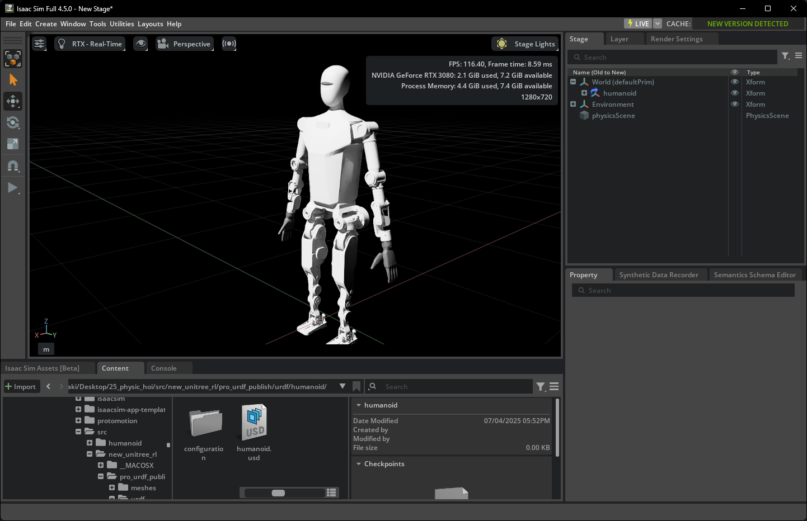
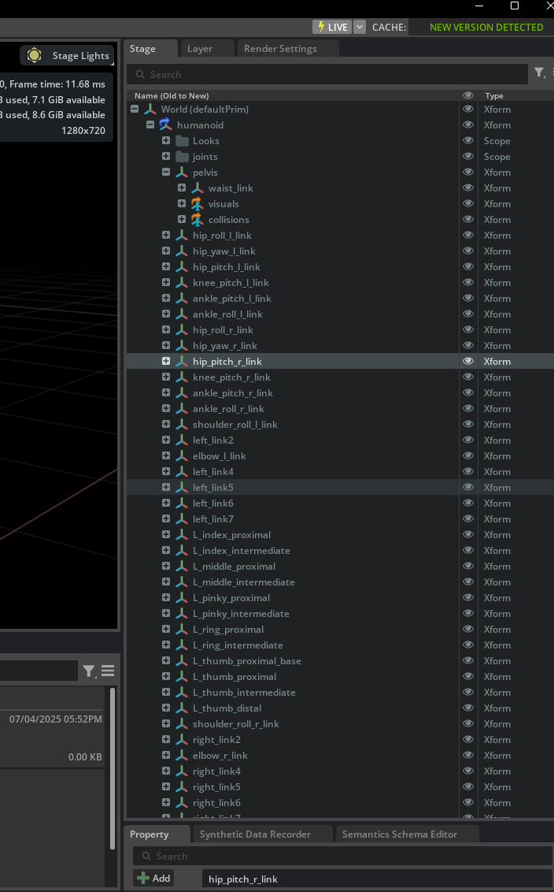
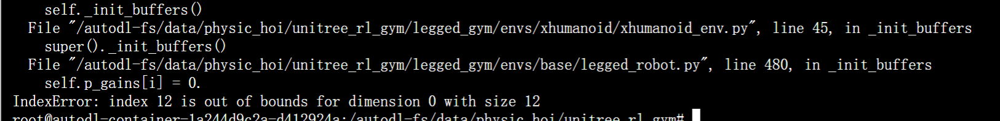
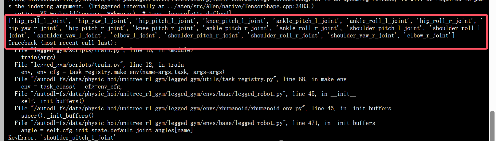
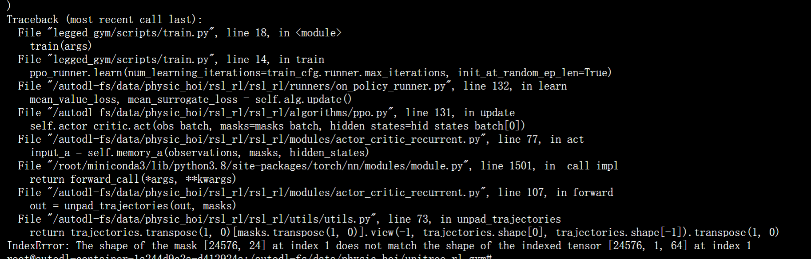
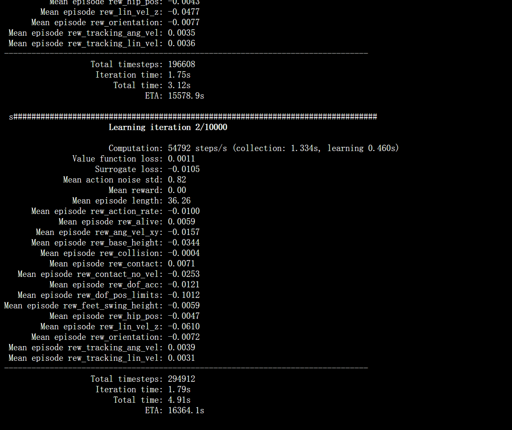
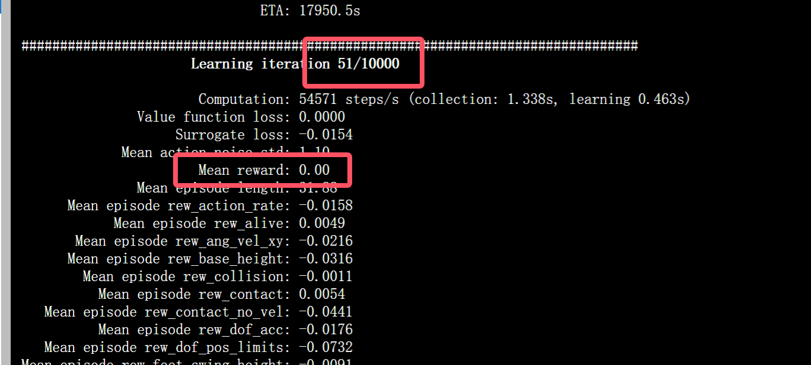
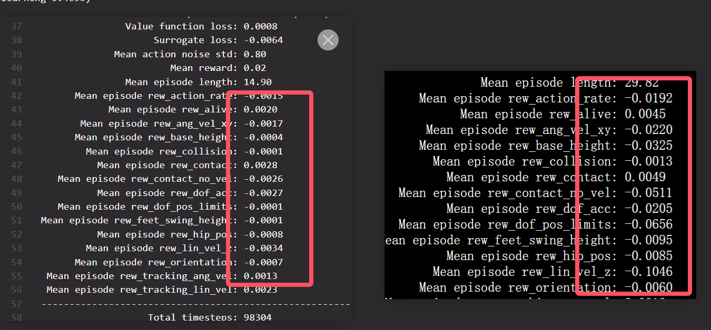
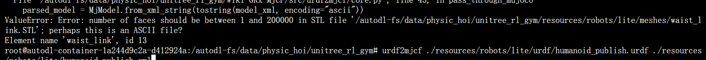
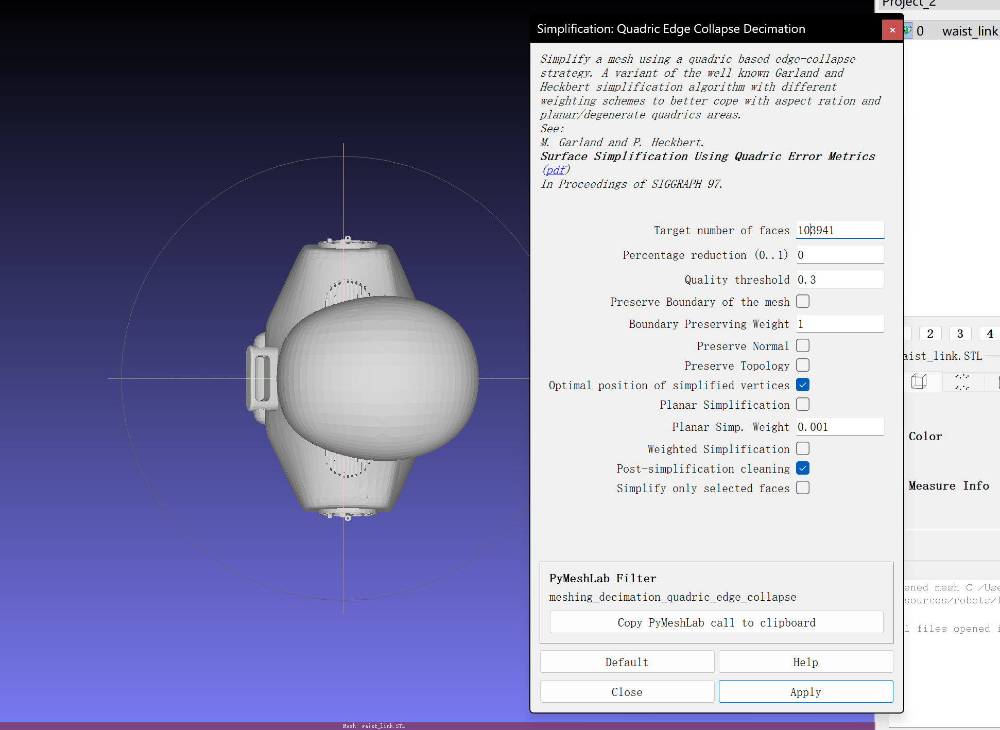

# 机器人迁移

## H1 文件结构解析

在开始之前，我们先来观察一下位于 `unitree_rl_gym\resources\robots\h1` 中 H1 机器人的文件结构。

```text
│  h1.xml
│  scene.xml
│
├─meshes
│      left_ankle_link.STL
│      left_elbow_link.STL
│      ...
│
└─urdf
        h1.urdf
```

它包含 `urdf` 文件夹、`meshes` 文件夹（内含许多STL文件）、`h1.xml` 和 `scene.xml`。我们在 `resources` 目录中看到的这些文件，共同构成了一个完整的机器人仿真模型。

### 1. URDF (Unified Robot Description Format) - `h1.urdf`

*   **扮演角色**: **机器人的“骨架蓝图”和“关节说明书”**。
*   **起到作用**: 这是整个机器人描述的**核心文件**。它是一个XML格式的文件，用文本定义了：
    *   **连杆 (Links)**: 机器人的各个身体部件，比如大腿、小腿、躯干。它会定义每个连杆的**物理属性**，如质量(mass)、惯性张量(inertial tensor)、以及碰撞体的形状(collision geometry)。
    *   **关节 (Joints)**: 连接这些连杆的部分。它定义了关节的类型（如旋转关节 `revolute`、固定关节 `fixed`）、运动轴(axis)、运动范围限制(limits in lower/upper)、以及**最重要的动力学限制**，如最大力矩(`effort`)和最大速度(`velocity`)。
    *   **父子关系**: 它定义了机器人身体部件如何一级一级连接起来，形成一个树状结构（运动学链）。
*   **一句话总结**: **URDF定义了机器人的所有物理和运动学属性，是物理引擎进行计算的依据。**

### 2. STL (STereoLithography) - `meshes/*.stl`

*   **扮演角色**: **机器人的“皮肤”和“形状”**。
*   **起到作用**: STL是一种描述三维物体表面几何形状的文件格式。它只包含几何信息（一堆小三角形面片），没有颜色、材质、质量等信息。在URDF中，它们被用于两个地方：
    *   **`<visual>` 标签**: 引用一个STL文件来定义连杆的**视觉外观**。这是我们在渲染画面中看到的机器人模型的样子，追求的是外观精美。
    *   **`<collision>` 标签**: 引用一个STL文件来定义连杆的**碰撞形状**。这是物理引擎用来计算碰撞的几何体。为了计算效率，碰撞模型通常会比视觉模型更简化（比如用一个简单的凸包代替复杂的外壳）。
*   **一句话总结**: **STL文件提供了机器人的三维几何模型，让URDF中定义的连杆有了具体的样子。**

### 3. XML - `h1.xml`, `scene.xml` (通常指 MJCF 格式)

*   **扮演角色**: **MuJoCo物理引擎的“专属配置文件”**。
*   **起到作用**: `h1.xml` 是一个 **MJCF (MuJoCo XML Format)** 文件。MuJoCo是另一个非常流行的物理引擎，它使用自己的一套XML格式来定义模型和场景。
    *   **功能重叠**: MJCF的功能与URDF非常相似，它也在一个文件中定义了连杆、关节、物理属性和几何模型。
    *   **为何存在**: 很多早期的或基于DeepMind研究的强化学习项目（比如早期的Isaac Gym示例）都使用MJCF格式。Isaac Sim/Lab为了兼容性，也支持加载MJCF文件。`scene.xml` 则可能是定义整个仿真场景的MJCF文件。
*   **一句话总结**: **MJCF是MuJoCo引擎版本的URDF，功能类似但格式不同。在Isaac Lab中，我们主要会和URDF及USD打交道。**

### 4. USD (Universal Scene Description)

我们在更早的实验中经常用到了USD格式的文件，那么USD又是什么，和上面的关联是什么？

*   **扮演角色**: **现代三维世界的“通用语言”和“最终舞台”**。
*   **是什么**: 由皮克斯（Pixar）动画工作室开发，并由NVIDIA的Omniverse平台发扬光大的一种文件格式和生态系统。它远比URDF或STL强大得多。
*   **起到作用**:
    *   **场景描述**: USD不仅仅能描述一个机器人，它能描述一个**完整的、动态的、可交互的三维场景**。这包括：几何模型、材质、纹理、光照、动画、物理属性、相机，甚至其他自定义数据。
    *   **非破坏性编辑与协作**: 它有一个非常强大的特性叫做“层 (Layers)”。不同的人可以在不同的层上对同一个场景进行修改（比如一个美术师调光照，一个动画师调动作），最终这些层会组合在一起，而不会互相破坏。
    *   **最终格式**: 在Isaac Sim/Lab的工作流中，所有的其他格式（URDF, STL, FBX等）通常都会被**导入 (import)** 并**转换 (convert)** 成USD格式。Isaac Sim的原生运行格式就是USD。我们之前在Content Browser里拖拽的`h1.usd`，就是URDF被转换后的最终产物。
*   **一句话总结**: **USD是Omniverse生态系统的基石，是集场景、物理、视觉于一体的终极格式。URDF只是其中关于机器人运动学物理描述的一部分。**

## 寻找其他可替换的Bot文件

我们需要找到提供 `urdf` 和 `mesh` 格式文件的机器人。

我们可以用天工 x-humanoid 中开源的urdf文件包：[https://x-humanoid.com/opensource.html](https://x-humanoid.com/opensource.html)

也可以去GitHub上面找找其他备选机器人：[https://github.com/robot-descriptions/awesome-robot-descriptions?tab=readme-ov-file](https://github.com/robot-descriptions/awesome-robot-descriptions?tab=readme-ov-file)

这里我们就直接使用天工的机器人。

> Importer会自动读取URDF，找到它引用的meshes文件，并将整个机器人转换为一个单独的 `.usd` 文件。**保存这个USD文件**，这是我们后续在Isaac Lab中使用的模型。

我们来尝试一下在Isaac Sim导入这个urdf文件，验证一下能不能正确使用模型：



可以看到我们的模型正确加载了。

## 模型适配任务 — 规划与解析

我们参考 `legged_gym` 的官方指南：[https://github.com/leggedrobotics/legged_gym](https://github.com/leggedrobotics/legged_gym)

> ### Adding a new environment
> The base environment `legged_robot` implements a rough terrain locomotion task. The corresponding cfg does not specify a robot asset (URDF/ MJCF) and has no reward scales. 
>
> 1. Add a new folder to `envs/` with `'<your_env>_config.py`, which inherit from an existing environment cfgs.
> 2. If adding a new robot:
>    - Add the corresponding assets to `resources/`.
>    - In `cfg` **set the asset path**, define **body names**, **default_joint_positions** and **PD gains**. Specify the desired `train_cfg` and the name of the environment (python class).
>    - In `train_cfg` set `experiment_name` and `run_name`.
> 3. (If needed) implement your environment in <your_env>.py, inherit from an existing environment, overwrite the desired functions and/or add your reward functions.
> 4. Register your env in `isaacgym_anymal/envs/__init__.py`.
> 5. Modify/Tune other parameters in your `cfg`, `cfg_train` as needed. To remove a reward set its scale to zero. Do not modify parameters of other envs!

另外，为了适配新的机器人，我们需要在环境中修改机器人的各自参数，包括：
- 修改关节的名字以确保映射
- 修改关键的damping与stiffness等参数以令电机正确驱动
- 修改摔倒和与地面接触的脚部等控制目标
- 修改奖励函数

`legged_gym` 的核心设计哲学就是**数据驱动**和**约定优于配置**。它通过Python配置文件来告诉通用的训练代码如何与一个特定的、黑盒的URDF文件进行交互。**所有适配工作都可以在Python配置文件中完成。**

### Part 1: `H1RoughCfg` 如何成为“URDF翻译官”？

我们以H1的配置文件 `unitree_rl_gym\legged_gym\envs\h1\h1_config.py` 作为参考，这个配置文件通过几种方式将H1机器人的特定信息“翻译”给通用的 `LeggedRobot` 环境：

#### 1. 初始状态设置 (直接的字典映射)
*   **代码示例**: `default_joint_angles`
*   **工作原理**: 这是一个Python字典，`key`是URDF中定义的**关节名字(字符串)**，`value`是它的初始角度。当 `legged_gym` 加载H1机器人时，它会遍历这个字典。对于字典里的每一个`key`，它会去URDF中查找同名的`<joint>`，然后将它的初始角度设置为对应的`value`。
*   **核心原因**: 我们的策略网络输出的动作是一个没有名字的、按固定顺序排列的向量。`legged_gym` 内部会维护一个关节顺序列表，这个列表就是根据`default_joint_angles`这个字典的键来生成的。只要我们在这个字典里正确地列出了新机器人的所有关节名，框架就能自动处理好一切映射关系。

```python
class init_state( LeggedRobotCfg.init_state ):
    pos = [0.0, 0.0, 1.0] # x,y,z [m]
    default_joint_angles = { # = target angles [rad] when action = 0.0
       'left_hip_yaw_joint' : 0. ,   
       'left_hip_roll_joint' : 0,               
       ...
    }
```

#### 2. 力矩参数设置 (基于关键字的参数应用)
*   **代码示例**: `stiffness` 和 `damping` (PD增益)
*   **工作原理**: 这也是字典，但它的 `key` 不是完整的关节名，而是**关键字**（如`hip_yaw`, `knee`）。框架在设置PD增益时，会遍历机器人的所有关节。如果一个关节的名字**包含**某个关键字，它就会应用这个关键字对应的stiffness和damping值。例如，`left_hip_yaw_joint` 和 `right_hip_yaw_joint` 都会应用 `hip_yaw: 150` 这个设置。
*   **优点**: 非常方便，我们不需要为左右两边的对称关节写重复的配置。

```python
class control( LeggedRobotCfg.control ):
    # PD Drive parameters:
    control_type = 'P'
    # PD Drive parameters:
    stiffness = {
        'hip_yaw': 150,
        ...
    }  # [N*m/rad]
    damping = {
        'hip_yaw': 2,
        ...
    }  # [N*m*s/rad]
```

#### 3. 碰撞检测 (基于名字的碰撞和接触检测)
*   **代码示例**: `foot_name`, `penalize_contacts_on`, `terminate_after_contacts_on`
*   **工作原理**: 这些变量存储的是**连杆(link)名字的关键字**。
    *   `foot_name = "ankle"`: 告诉框架，任何连杆名字中包含 "ankle" 的，都被认为是脚部，用来计算触地状态。
    *   `penalize_contacts_on = ["hip", "knee"]`: 如果机器人的“hip”或“knee”连杆碰到了地面，就在奖励函数中给一个惩罚。
    *   `terminate_after_contacts_on = ["pelvis"]`: 如果“pelvis”连杆碰到了地面，就判定为摔倒，结束当前回合。
*   **作用**: 让我们可以精细地控制奖励和终止条件，而无需修改物理模型。

```python
class asset( LeggedRobotCfg.asset ):
    file = '{LEGGED_GYM_ROOT_DIR}/resources/robots/h1/urdf/h1.urdf'
    name = "h1"
    foot_name = "ankle"
    penalize_contacts_on = ["hip", "knee"]
    terminate_after_contacts_on = ["pelvis"]
    self_collisions = 0 # 1 to disable, 0 to enable...bitwise filter
    flip_visual_attachments = False
```

#### 4. 动作与观察空间

```python
class env(LeggedRobotCfg.env):
    num_observations = 41
    num_privileged_obs = 44
    num_actions = 10
```

正确设置 `num_observations`, `num_privileged_obs`, 和 `num_actions` 是让训练成功启动的前提。这三个值必须根据我们新机器人的特性进行**精确计算**，不能简单地沿用H1的设置。

##### `num_actions`: 动作空间维度
*   **含义**: 策略网络需要输出多少个控制指令。在 `legged_gym` 的默认PD控制模式下，这等于机器人需要**被控制的可动关节数量**。
*   **示例**: 如果机器人`default_joint_angles`有22个关节，那么 `num_actions` 就必须设置为 `22`。

##### `num_observations`: 观测空间维度
这个稍微复杂一些，因为它是由多个部分拼接而成的。我们需要去查看 `legged_gym/envs/base/legged_robot.py` 这个文件中的 `compute_observations` 函数来找到答案。
`legged_gym` 默认的观测空间 (`obs`) 通常包含以下部分：
1.  **线速度 (Linear Velocity)**: 机器人躯干的 `x, y, z` 三个方向的速度。 (维度: **3**)
2.  **角速度 (Angular Velocity)**: 机器人躯干绕 `x, y, z` 三个轴的角速度。 (维度: **3**)
3.  **重力向量 (Gravity Vector)**: 机器人躯干坐标系下的重力方向。 (维度: **3**)
4.  **指令 (Commands)**: 机器人需要执行的指令，包括 `x`方向目标线速度、`z`方向目标角速度。 (维度: **2**)
5.  **关节位置 (DOF Positions)**: 机器人所有被控关节的当前角度。其维度等于 `num_actions`。 (维度: **`num_actions`**)
6.  **关节速度 (DOF Velocities)**: 机器人所有被控关节的当前角速度。其维度等于 `num_actions`。 (维度: **`num_actions`**)
7.  **上一轮的动作 (Previous Actions)**: 策略网络在上一时间步输出的动作。其维度等于 `num_actions`。 (维度: **`num_actions`**)

**计算公式**:
`num_observations = 3 (lin_vel) + 3 (ang_vel) + 3 (gravity) + 2 (commands) + num_actions (pos) + num_actions (vel) + num_actions (actions)`
`num_observations = 11 + 3 * num_actions`

**我们来验证一下H1的配置 (`num_actions = 10`)**:
`3 + 3 + 3 + 2 + 10 + 10 + 10 = 41`. (注：原始公式中我们计算的常数项为12，根据H1的配置，常数项应为11，这里按H1的最终结果进行校正)

##### `num_privileged_obs`: 特权观测空间维度
“特权观测”是只有在**仿真中才能获取**的、物理世界中难以精确测量的“上帝视角”信息。这些信息**只提供给Critic网络**（用于评估状态价值），而不提供给Actor网络（用于生成动作）。
特权观测 (`privileged_obs`) 通常包含：
1.  **地形信息**: 机器人脚底周围地形的高度图 (Height Map)。
2.  **摩擦系数**: 机器人与地面之间的摩擦系数。
3.  **施加的外力**: 仿真中对机器人施加的随机推力。

---

### Part 2: 具体行动 (为新机器人创建配置)

现在，我们严格按照 `legged_gym` 的指示，并结合我们对`H1RoughCfg`的理解，来为新机器人创建一个配置文件。

#### 第1步: 创建新文件夹和配置文件
*   在 `envs/` 目录下，创建一个新文件夹，命名为 `xhumanoid`。
*   将 `envs/h1/h1_config.py` 复制到 `envs/xhumanoid/` 目录下，并重命名为 `xhumanoid_cfg.py`。

#### 第2步: 修改 `xhumanoid_cfg.py` (核心工作)
打开新的 `xhumanoid_cfg.py` 文件，我们来逐个`class`进行修改。

1.  **修改 `class asset`**:
    *   `file`: 将路径修改为新机器人的URDF文件路径。
    *   `name`: 修改为新机器人的名字，如 `"xhumanoid"`。
    *   `foot_name`: **检查URDF**，找到脚部连杆的名字关键字。
    *   `penalize_contacts_on`: **检查URDF**，找到大腿、小腿等不希望发生碰撞的连杆名字关键字。
    *   `terminate_after_contacts_on`: **检查URDF**，找到躯干或骨盆连杆的名字关键字。
    ```python
    class asset( LeggedRobotCfg.asset ):
        file = '{LEGGED_GYM_ROOT_DIR}/resources/robots/xhumanoid/urdf/humanoid.urdf'
        name = "xhumanoid"
        foot_name = "ankle_roll" # 示例
        ...
    ```

2.  **修改 `class init_state`**:
    *   `pos`: 根据新机器人的身高，设置一个合理的初始站立高度。
    *   `default_joint_angles`: **这是最关键的一步**。
        *   **清空**原有的H1关节字典。
        *   **逐一查看**新机器人的URDF文件中的每一个可动关节 (`type="revolute"` 或 `type="continuous"`)。
        *   将它们的 `name` 复制过来作为字典的 `key`，并设置一个合理的初始站姿角度 `value`。

3.  **修改 `class control`**:
    *   `stiffness` 和 `damping`: 这是一个需要**反复调试**的过程。
        *   **初始值**: 可以参考URDF中每个关节的 `<limit effort="...">` 值。力矩越大的关节，通常可以设置越高的 `stiffness`。
        *   我们可以先使用H1的关键字和数值作为起点，然后根据新机器人的关节命名，调整关键字。
        *   `damping` 通常是 `stiffness` 的一个较小比例，用于稳定系统。
    *   `action_scale`: 可以暂时保持不变，后续再进行调试。

4.  **修改 `class env`**:
    *   `num_actions`: **必须修改**。这个值必须严格等于我们在`default_joint_angles`字典中定义的关节数量。
    *   `num_observations`: **必须修改**。根据公式 `11 + 3 * num_actions` 计算新值。
    *   `num_privileged_obs`: 根据需要调整。

5.  **修改 `class rewards`**:
    *   `base_height_target`: 修改为我们希望新机器人保持的目标站立高度。
    *   `scales`: 奖励权重可以暂时保持不变，这是后续训练中主要调试的部分。

#### 第3步: 注册我们的环境
*   打开 `envs/__init__.py` 文件。
*   在文件的末尾添加一行，来注册我们的新配置：
```python
from legged_gym.envs.xhumanoid.xhumanoid_config import XHumanoidRoughCfg, XHumanoidRoughCfgPPO
from legged_gym.envs.xhumanoid.xhumanoid_env import XHumanoidRobot

task_registry.register("xhumanoid", XHumanoidRobot, XHumanoidRoughCfg(), XHumanoidRoughCfgPPO())
```

#### 第4步: 修改训练配置
*   在 `xhumanoid_cfg.py` 文件的末尾，修改 `class H1RoughCfgPPO` 为 `class XHumanoidRoughCfgPPO`。
*   在 `class runner` 中，将 `experiment_name` 修改为 `'xhumanoid'`，并将 `run_name` 设置为一个新的名字，比如 `'first_try'`。

### 探索 1：`num_actions` 与关节数量不匹配问题

通过观察H1的配置文件，我发现在`H1RoughCfg`中的 `num_actions` 仅为10，虽然在它的`default_joint_angles`中包含了多于10个关节。我最初的推测是，action space中仅包含下肢的可动关节，而上肢的相关参数被自动处理或固定了。

```python
# H1 Config
num_actions = 10
```
```python
# H1 Config
default_joint_angles = { # = target angles [rad] when action = 0.0
   'left_hip_yaw_joint' : 0. ,   
   'left_hip_roll_joint' : 0,               
   'left_hip_pitch_joint' : -0.1,         
   'left_knee_joint' : 0.3,       
   'left_ankle_joint' : -0.2,     
   'right_hip_yaw_joint' : 0., 
   'right_hip_roll_joint' : 0, 
   'right_hip_pitch_joint' : -0.1,                                       
   'right_knee_joint' : 0.3,                                             
   'right_ankle_joint' : -0.2,                                     
   'torso_joint' : 0., 
   'left_shoulder_pitch_joint' : 0., 
   'left_shoulder_roll_joint' : 0, 
   'left_shoulder_yaw_joint' : 0.,
   'left_elbow_joint'  : 0.,
   'right_shoulder_pitch_joint' : 0.,
   'right_shoulder_roll_joint' : 0.0,
   'right_shoulder_yaw_joint' : 0.,
   'right_elbow_joint' : 0.,
}
```

在Isaac Sim中我们可以看到我们加载的机器人有多少个关节以及他们的名字：


我们仿照H1的配置，将新旧机器人的关节名进行映射：

| 部件 | Unitree H1 | X-Humanoid |
|:--- |:--- |:--- |
| hip_yaw | `*_hip_yaw_joint` | `hip_yaw_*_joint` |
| hip_roll | `*_hip_roll_joint` | `hip_roll_*_joint` |
| hip_pitch | `*_hip_pitch_joint` | `hip_pitch_*_joint` |
| knee | `*_knee_joint` | `knee_pitch_*_joint` |
| ankle | `*_ankle_joint` | `ankle_roll_*_joint` |
| torso | `torso_joint` | - |
| shoulder_yaw | `*_shoulder_yaw_joint` | `*_joint1` |
| shoulder_roll | `*_shoulder_roll_joint` | `shoulder_roll_*_joint` |
| shoulder_pitch | `*_shoulder_pitch_joint` | `*_joint3` |
| elbow | `*_elbow_joint` | `elbow_*_joint` |

然后为新机器人创建 `default_joint_angles`：
```python
default_joint_angles = {
   'hip_yaw_l_joint' : 0. ,   
   'hip_roll_l_joint' : 0,               
   'hip_pitch_l_joint' : -0.1,         
   'knee_pitch_l_joint' : 0.3,       
   'ankle_roll_l_joint' : -0.2,     
   'hip_yaw_r_joint' : 0. ,   
   'hip_roll_r_joint' : 0,               
   'hip_pitch_r_joint' : -0.1,                                               
   'knee_pitch_r_joint' : 0.3,                                             
   'ankle_roll_r_joint' : -0.2,                                     
   # 'torso_joint' : 0., 
   'shoulder_roll_l_joint' : 0, 
   'elbow_l_joint'  : 0.,
   'shoulder_roll_r_joint' : 0, 
   'elbow_r_joint'  : 0.,
}
```

对于控制参数，我们基于URDF中的`effort`和`velocity`，通过以下假设进行映射：
*   **核心假设**: 关节的最佳刚度 (Stiffness) 与其电机的最大输出力矩 (Effort) 正相关。
*   **Stiffness 公式**: `xhumanoid_stiffness = H1_stiffness * (xhumanoid_effort / H1_effort)`
*   **Damping 公式**: `xhumanoid_damping = H1_damping * sqrt(xhumanoid_stiffness / H1_stiffness)`

参数对比与计算表：
| 部件 | H1 | xhumanoid | H1 effort | H1 velocity | xhumanoid effort | xhumanoid velocity | H1 stiffness | H1 damping |
|:--- |:--- |:--- |:--- |:--- |:--- |:--- |:--- |:--- |
| hip_yaw | `*_hip_yaw_joint` | `hip_yaw_*_joint` | 200 | 23 | 90 | 14 | 150 | 2 |
| hip_roll | `*_hip_roll_joint` | `hip_roll_*_joint` | 200 | 23 | 150 | 12 | 150 | 2 |
| hip_pitch | `*_hip_pitch_joint` | `hip_pitch_*_joint` | 200 | 23 | 150 | 12 | 150 | 2 |
| knee | `*_knee_joint` | `knee_pitch_*_joint` | 300 | 14 | 150 | 12 | 200 | 4 |
| ankle | `*_ankle_joint` | `ankle_roll_*_joint` | 40 | 9 | 30 | 7.8 | 40 | 2 |
| torso | `torso_joint` | - | | | | | | |
| shoulder_yaw | `*_shoulder_yaw_joint` | `*_joint1` | 18 | 20 | 40 | 3.14 | 150 | 2 |
| shoulder_roll | `*_shoulder_roll_joint`| `shoulder_roll_*_joint` | 40 | 9 | 40 | 3.14 | 150 | 2 |
| shoulder_pitch | `*_shoulder_pitch_joint`| `*_joint3` | 40 | 9 | 22 | 4.18 | 150 | 2 |
| elbow | `*_elbow_joint` | `elbow_*_joint` | 18 | 20 | 22 | 4.18 | 100 | 2 |

根据上述公式计算出的新参数：
```python
# stiffness 和 damping 的初步估算值
stiffness = {
    'hip_yaw': 68,
    'hip_roll': 113, 
    'hip_pitch': 113,
    'knee': 100,      
    'ankle': 30,  
    'joint1': 113,
    'shoulder_roll': 150,
    'joint3': 83,
    'elbow': 122, 
}
damping = {
    'hip_yaw': 1.3,  
    'hip_roll': 1.7,  
    'hip_pitch': 1.7, 
    'knee': 2.8,
    'ankle': 1.7, 
    'joint1': 1.7,
    'shoulder_roll': 2.0,
    'joint3': 1.5,
    'elbow': 2.2,  
}
```

**但是，这显然不行！** 在运行时直接报出索引越界的错误：


在排查原因时，我发现 `envs/base/legged_robot.py` 在初始化时会先检测机器人中所有的可动关节(dof)，之后遍历 `default_joint_angles` 和 `stiffness` 中的键来匹配可动关节的名称。

**结论**: `default_joint_angles` 的键值对数应当严格匹配机器人可动关节的个数。`stiffness` 与 `damping` 中的参数是以 partial match 的形式进行匹配。

我们直接在代码中把 `self.dof_names` 打印出来：


所以，严格来说对于我们的 `天工 xhumanoid lite`，所有可动关节数应当是 **20**。
最终的 `default_joint_angles` 应当包含所有的可动关节：
```python
default_joint_angles = {
    'hip_roll_l_joint': 0,
    'hip_yaw_l_joint': 0,
    'hip_pitch_l_joint': 0,
    'knee_pitch_l_joint': 0,
    'ankle_pitch_l_joint': 0,
    'ankle_roll_l_joint': 0,
    'hip_roll_r_joint': 0,
    'hip_yaw_r_joint': 0,
    'hip_pitch_r_joint': 0,
    'knee_pitch_r_joint': 0,
    'ankle_pitch_r_joint': 0,
    'ankle_roll_r_joint': 0,
    'shoulder_pitch_l_joint': 0,
    'shoulder_roll_l_joint': 0,
    'shoulder_yaw_l_joint': 0,
    'elbow_l_joint': 0,
    'shoulder_pitch_r_joint': 0,
    'shoulder_roll_r_joint': 0,
    'shoulder_yaw_r_joint': 0,
    'elbow_r_joint': 0,
}
```
同时修改 `class env` 中的观察和动作数 (num_actions = 20, num_obs = 11 + 3*20 = 71)：
```python
class env(LeggedRobotCfg.env):
    num_observations = 71
    # num_privileged_obs 也需要相应调整
    num_privileged_obs = 74 
    num_actions = 20
```
这样关节就能全部匹配上了，我们可以直接开始训练：


**但是它又失败了！** 我发现它输出的维度貌似是 `[num_env, time_length, hid_dim]`，其中 `time_length` 貌似是 1，意味着物理模拟环境在一开始就中断了。在寻找错误原因的过程中，我尝试修改 `asset` 类中的 `self_collisions` 参数为 `1`，即**禁用机器人内部的自碰撞**，之后即可成功进行训练:



### 探索 2：深入 URDF — 为何 H1 只有 10 个动作？

虽然代码成功跑起来了，但是模型的 `mean_reward` 一直都是0，这令我百思不得其解。


通过观察每一项reward，我发现在很多部分的loss在起始的时候都要比官方给出的示例高不少：


这令我回去反思：为什么H1和G1中的可动关节数要少于URDF文件中的关节数？这时我尝试把它提供的H1的URDF文件直接拖进Isaac Sim中，我发现这个H1只有下半身的关节点是可动的。那么上半身去哪了？这就需要深入理解URDF文件中的定义。

---
#### **URDF 核心结构概览**
一个URDF文件本质上是一个XML文件，它通过一系列的标签来描述一个机器人的**物理结构**和**运动学特性**。其核心组件只有两个：**连杆 (Link)** 和 **关节 (Joint)**。

**1. `<link>` 标签：机器人的“骨骼”和“肉”**

`link` 代表机器人的一个刚性部件，内部包含三个核心子标签：
*   **`<visual>`**: 这个连杆长什么样？(用于可视化，不参与物理计算)
*   **`<collision>`**: 这个连杆的碰撞形状是什么？(用于物理引擎计算碰撞，通常是简化模型)
*   **`<inertial>`**: 这个连杆的物理属性是什么？(包括质量、质心、惯性张量，是动力学计算的核心)

**2. `<joint>` 标签：机器人的“关节”**

`joint` 连接两个 `link`，并定义了它们之间的**相对运动方式**。
一个典型的 `<joint>` 标签包含：
*   **`type` 属性**: 定义关节类型，如：
    *   `revolute`: 转动关节 (1 DOF)
    *   `prismatic`: 移动关节 (1 DOF)
    *   `continuous`: 连续转动关节
    *   `fixed`: **固定关节**，不允许任何相对运动 (0 DOF)
    *   `floating`: 浮动关节 (6 DOF)
*   **`<parent>` 和 `<child>`**: 定义连接关系，构建运动学树。
*   **`<origin>`**: 定义关节的几何位置。
*   **`<axis>`**: 定义旋转或滑动的轴线。
*   **`<limit>`**: 定义运动限制，包括范围 (`lower`, `upper`)、最大力矩 (`effort`) 和最大速度 (`velocity`)。

---

通过观察官方提供示例中H1的URDF文件，我们发现在一些上半身的关键处例如 `shoulder`，它的 `type` 标签中写的是 `fixed`，意味着这个关节是**不可动关节**。
```xml
<joint
    name="left_shoulder_yaw_joint"
    type="fixed">
    <origin ... />
</joint>
```
这样观察下来，H1中的可动关节只有腿部的那几个，也就是**刚刚好10个**！这就可以说得通了。同时，H1原版的示例代码是基于10个可动关节设计的，而我们新导入的、有20个可动关节的机器人，原先的奖励函数和参数可能就不太合适了。

**正确做法**: 我们也应该把我们的模型上半身的可动关节在URDF中修改为 `type="fixed"`，只保留下半身的可动关节，这样就能保证我们的实验在动作和观察空间上尽可能与原实验保持一致。

修改后，我们的机器人下半身有12个可动关节。相应地修改配置文件：
```python
class env(LeggedRobotCfg.env):
    # num_actions = 12, num_obs = 11 + 3 * 12 = 47
    num_observations = 47
    num_privileged_obs = 50 # 相应调整
    num_actions = 12

class control(LeggedRobotCfg.control):
    # ...
    stiffness = {
        'hip_roll_l_joint': 113, 
        'hip_yaw_l_joint': 68, 
        'hip_pitch_l_joint': 113, 
        'knee_pitch_l_joint': 100, 
        'ankle_pitch_l_joint': 60, 
        'ankle_roll_l_joint': 30, 
        'hip_roll_r_joint': 113, 
        'hip_yaw_r_joint': 68, 
        'hip_pitch_r_joint': 113, 
        'knee_pitch_r_joint': 100, 
        'ankle_pitch_r_joint': 60, 
        'ankle_roll_r_joint': 30, 
    }
    # ... damping也应相应修改
```
这时候开始我们的实验，我们发现虽然奖励函数各项的初始差异相比之前变小了，但是 `mean_reward` 仍然长时间保持0，与原实验仍然有差距。

### 探索 3：调试奖励函数

机器人的总奖励函数是一堆子项的加权和，并且与0取最大值 (`max(0, sum_of_rewards)`)。这意味着如果模型在初始状态时，大部分reward项给的都是比较大的负数，那么总奖励为0，模型必然学不到任何东西。

**策略**: 尝试把在初始状态时正向reward的权重稍微调大，负向的reward权重稍微调小一点。

这是我们调整前后的 `scales` 对比：
```python
# --- 原版 ---
class scales( LeggedRobotCfg.rewards.scales ):
    tracking_lin_vel = 1.0
    tracking_ang_vel = 0.5
    lin_vel_z = -2.0
    ang_vel_xy = -0.05
    orientation = -1.0
    base_height = -10.0
    dof_acc = -2.5e-7
    feet_air_time = 0.0
    collision = -1.0
    action_rate = -0.01
    torques = 0.0
    dof_pos_limits = -5.0
    alive = 0.15
    hip_pos = -1.0
    contact_no_vel = -0.2
    feet_swing_height = -20.0
    contact = 0.18

# --- 修改版 ---
class scales( LeggedRobotCfg.rewards.scales ):
    tracking_lin_vel = 1.0
    tracking_ang_vel = 0.5
    lin_vel_z = -0.2          # 减小z轴速度惩罚
    ang_vel_xy = -0.05
    orientation = -1.0
    base_height = -10.0
    dof_acc = -2.5e-7
    dof_vel = -1e-3
    feet_air_time = 0.0
    collision = 0.0           # 移除碰撞惩罚 (自碰撞已在asset中禁用)
    action_rate = -0.01
    dof_pos_limits = -5.0
    alive = 1.5               # 大幅增加存活奖励
    hip_pos = -1.0
    contact_no_vel = -0.02    # 减小接触速度惩罚
    feet_swing_height = -20.0
    contact = 0.18
```
经过调整，我们的模型总算能正常训练起来了！最终我们取了最后一个ckpt，其 `mean_reward` 达到 **45** 左右。

## MuJoCo 部署

我们手头上现在只有URDF文件，需要将其转换为MuJoCo所需要的MJCF文件。

**参考教程**:
*   [Mujoco教程1：将URDF转换XML文件](https://zhuanlan.zhihu.com/p/699075829)
*   [FFTAI/Wiki-GRx-MJCF](https://github.com/FFTAI/Wiki-GRx-MJCF)

但在转换时报错，提示模型的面数太高（超过20w面），MuJoCo的XML无法解析：


**解决方案**: 使用 [MeshLab](https://www.meshlab.net/) 软件，将超过面数限制的单元（如 `waist_link`、`pelvis`）进行“二次曲面边缘简化”来裁剪面数。



转换成功后，在仿真中发现机器人自碰撞导致行为异常。我们需要关闭自碰撞检测。

**解决方案**: 使用 `contype` 和 `conaffinity` 属性。
这是一种“锁和钥匙”系统，用于控制哪些几何体之间可以发生碰撞。
*   **`contype` (Contact Type)**: 定义几何体拥有的“锁”的类型。
*   **`conaffinity` (Contact Affinity)**: 定义几何体可以匹配的“钥匙”的类型。
*   **碰撞条件**: 只有当A的`contype` & B的`conaffinity` != 0 **且** B的`contype` & A的`conaffinity` != 0 时，碰撞才会被计算。

**操作步骤**:
1.  **为机器人身体几何体分配专属碰撞组**：
    *   在机器人的MJCF文件中，为**所有**属于机器人身体的`<geom>`标签添加 `contype="2"` 和 `conaffinity="1"`。
    ```xml
    <!-- 在机器人MJCF文件中 -->
    <geom name="some_robot_part_geom" ... contype="2" conaffinity="1"/>
    ```
2.  **确保环境（如地板）的碰撞设置兼容**：
    *   在场景的XML文件中，为地板的`<geom>`标签设置 `contype="1"` 和 `conaffinity="3"`。
    ```xml
    <!-- 在场景XML文件中 -->
    <geom name="floor" type="plane" ... contype="1" conaffinity="3"/>
    ```

**原理解释**:
*   **机器人**: 有2号锁，但只有1号钥匙。因此，机器人部件之间无法互相碰撞（2号锁配不上1号钥匙）。
*   **地板**: 有1号锁，有1号和2号钥匙。因此，机器人可以和地板碰撞（机器人的2号锁可以被地板的2号钥匙打开，地板的1号锁可以被机器人的1号钥匙打开）。

### 实验结果

<video controls src="images/New_rl_gym/MuJoCo _ humanoid scene 2025-07-10 02-47-36.mp4" title="MuJoCo 部署效果" style="width:100%;"></video>

**结果分析**:
可以看到我们的机器人貌似在走“螃蟹步”。这是因为我给他加了比较大的`alive`奖励，同时关闭了内部自碰撞检测。机器人在移动时，发现侧向移动可以让身体不摔倒，而腿之间没有碰撞检测也使得双腿可以交替地横着走。

尽管如此，机器人也还算是勉强按照目标向某个方向运动了起来，达到了阶段性的目标。虽然我们还没有完全达到官方的效果，但由于时间的限制，我们还没有太多时间微调参数使其更像“人”。