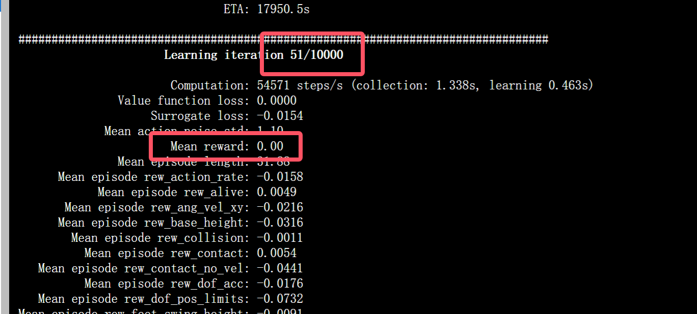
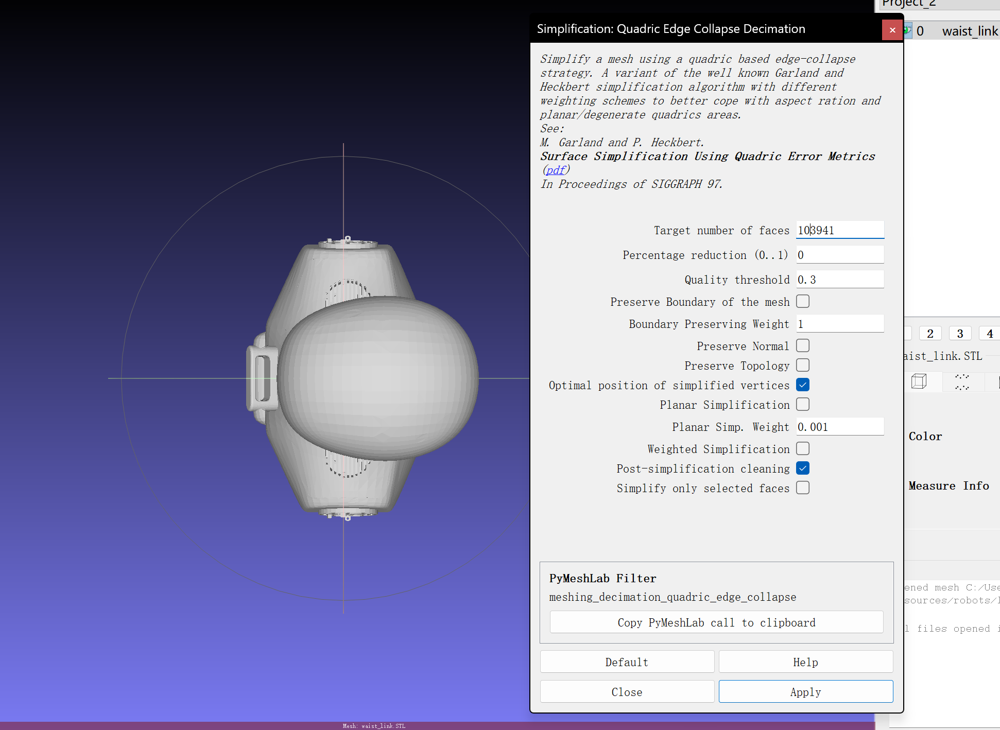

# 机器人迁移

## 观察文件中的

## H1文件结构解析
在开始之前我们先来观察一下位于`unitree_rl_gym\resources\robots\h1` 中H1机器人的文件结构

│  h1.xml
│  scene.xml
│
├─meshes
│      left_ankle_link.STL
│      left_elbow_link.STL
|      ...
│
└─urdf
        h1.urdf

它包含urdf，meshes下面有很多STL，有h1.xml和scene.xml，我们在 `data` 中看到的这些文件，共同构成了一个完整的机器人仿真模型。

### **1. URDF (Unified Robot Description Format) - `h1.urdf`**
*   **扮演角色**: **机器人的“骨架蓝图”和“关节说明书”**。
*   **起到作用**: 这是整个机器人描述的**核心文件**。它是一个XML格式的文件，用文本定义了：
    *   **连杆 (Links)**: 机器人的各个身体部件，比如大腿、小腿、躯干。它会定义每个连杆的**物理属性**，如质量(mass)、惯性张量(inertial tensor)、以及碰撞体的形状(collision geometry)。
    *   **关节 (Joints)**: 连接这些连杆的部分。它定义了关节的类型（如旋转关节 `revolute`、固定关节 `fixed`）、运动轴(axis)、运动范围限制(limits in lower/upper)、以及**最重要的动力学限制**，如最大力矩(`effort`)和最大速度(`velocity`)。
    *   **父子关系**: 它定义了机器人身体部件如何一级一级连接起来，形成一个树状结构（运动学链）。
*   **一句话总结**: **URDF定义了机器人的所有物理和运动学属性，是物理引擎进行计算的依据。**

### **2. STL (STereoLithography) - `meshes/*.stl`**
*   **扮演角色**: **机器人的“皮肤”和“形状”**。
*   **起到作用**: STL是一种描述三维物体表面几何形状的文件格式。它只包含几何信息（一堆小三角形面片），没有颜色、材质、质量等信息。在URDF中，它们被用于两个地方：
    *   **`<visual>` 标签**: 引用一个STL文件来定义连杆的**视觉外观**。这是我们在渲染画面中看到的机器人模型的样子，追求的是外观精美。
    *   **`<collision>` 标签**: 引用一个STL文件来定义连杆的**碰撞形状**。这是物理引擎用来计算碰撞的几何体。为了计算效率，碰撞模型通常会比视觉模型更简化（比如用一个简单的凸包代替复杂的外壳）。
*   **一句话总结**: **STL文件提供了机器人的三维几何模型，让URDF中定义的连杆有了具体的样子。**

### **3. XML - `h1.xml`, `scene.xml` (通常指 MJCF 格式)**
*   **扮演角色**: **MuJoCo物理引擎的“专属配置文件”**。
*   **起到作用**: `h1.xml` 是一个 **MJCF (MuJoCo XML Format)** 文件。MuJoCo是另一个非常流行的物理引擎，它使用自己的一套XML格式来定义模型和场景。
    *   **功能重叠**: MJCF的功能与URDF非常相似，它也在一个文件中定义了连杆、关节、物理属性和几何模型。
    *   **为何存在**: 很多早期的或基于DeepMind研究的强化学习项目（比如早期的Isaac Gym示例）都使用MJCF格式。Isaac Sim/Lab为了兼容性，也支持加载MJCF文件。`scene.xml` 则可能是定义整个仿真场景的MJCF文件。
*   **一句话总结**: **MJCF是MuJoCo引擎版本的URDF，功能类似但格式不同。在Isaac Lab中，我们主要会和URDF及USD打交道。**

### **USD (Universal Scene Description)**
我们在更早的实验中经常用到了usd格式的文件，那么usd又是什么，和上面的关联是什么？

*   **扮演角色**: **现代三维世界的“通用语言”和“最终舞台”**。
*   **是什么**: 由皮克斯（Pixar）动画工作室开发，并由NVIDIA的Omniverse平台发扬光大的一种文件格式和生态系统。它远比URDF或STL强大得多。
*   **起到作用**:
    *   **场景描述**: USD不仅仅能描述一个机器人，它能描述一个**完整的、动态的、可交互的三维场景**。这包括：几何模型、材质、纹理、光照、动画、物理属性、相机，甚至其他自定义数据。
    *   **非破坏性编辑与协作**: 它有一个非常强大的特性叫做“层 (Layers)”。不同的人可以在不同的层上对同一个场景进行修改（比如一个美术师调光照，一个动画师调动作），最终这些层会组合在一起，而不会互相破坏。
    *   **最终格式**: 在Isaac Sim/Lab的工作流中，所有的其他格式（URDF, STL, FBX等）通常都会被**导入 (import)** 并**转换 (convert)** 成USD格式。Isaac Sim的原生运行格式就是USD。我们之前在Content Browser里拖拽的`h1.usd`，就是URDF被转换后的最终产物。
*   **一句话总结**: **USD是Omniverse生态系统的基石，是集场景、物理、视觉于一体的终极格式。URDF只是其中关于机器人运动学物理描述的一部分。**

## 寻找其他可替换的bot文件
我们需要找到提供 urdf 和 mesh 格式文件的机器人。

我们可以用 天工 x-humanoid 中开源的urdf文件包： https://x-humanoid.com/opensource.html

也可以去github上面找找其他备选机器人
https://github.com/robot-descriptions/awesome-robot-descriptions?tab=readme-ov-file

这里我们就直接使用天工的机器人。

Importer会自动读取URDF，找到它引用的meshes文件，并将整个机器人转换为一个单独的 `.usd` 文件。**保存这个USD文件**，这是我们后续在Isaac Lab中使用的模型。

我们来尝试一下在isaacsim导入这个urdf文件，验证一下能不能正确使用模型：


可以看到我们的模型正确加载了

## **Part 3: “模型适配”任务，规划与解析**
https://github.com/leggedrobotics/legged_gym

### Adding a new environment
The base environment `legged_robot` implements a rough terrain locomotion task. The corresponding cfg does not specify a robot asset (URDF/ MJCF) and has no reward scales. 

1. Add a new folder to `envs/` with `'<your_env>_config.py`, which inherit from an existing environment cfgs  
2. If adding a new robot:
    - Add the corresponding assets to `resources/`.
    - In `cfg` **set the asset path**, define **body names**, **default_joint_positions** and **PD gains**. Specify the desired `train_cfg` and the name of the environment (python class).
    - In `train_cfg` set `experiment_name` and `run_name`
3. (If needed) implement your environment in <your_env>.py, inherit from an existing environment, overwrite the desired functions and/or add your reward functions.
4. Register your env in `isaacgym_anymal/envs/__init__.py`.
5. Modify/Tune other parameters in your `cfg`, `cfg_train` as needed. To remove a reward set its scale to zero. Do not modify parameters of other envs!


另外为了适配新的机器人，我们需要再环境中修改机器人的各自参数，包括：
- 修改关节的名字以确保映射
- 修改关键的damp与snifness等参数以令电机正确驱动
- 修改摔倒和与地面接触的脚部等控制目标
- 修改奖励函数

`legged_gym` 的核心设计哲学就是**数据驱动**和**约定优于配置**。它通过Python配置文件来告诉通用的训练代码如何与一个特定的、黑盒的URDF文件进行交互。**所有适配工作都可以在Python配置文件中完成。**

### **Part 1: `H1RoughCfg` 如何成为“URDF翻译官”？**

我们以H1的配置文件 `unitree_rl_gym\legged_gym\envs\h1\h1_config.py` 作为参考，这个配置文件通过几种方式将H1机器人的特定信息“翻译”给通用的 `LeggedRobot` 环境：

#### 初始状态设置

1.  **直接的字典映射 (最关键)**
    *   **代码示例**: `default_joint_angles`
    *   **工作原理**: 这是一个Python字典，`key`是URDF中定义的**关节名字(字符串)**，`value`是它的初始角度。当 `legged_gym` 加载H1机器人时，它会遍历这个字典。对于字典里的每一个`key`，它会去URDF中查找同名的`<joint>`，然后将它的初始角度设置为对应的`value`。
    *   **这就是您不需要修改URDF的核心原因**: 您的策略网络输出的动作是一个没有名字的、按固定顺序排列的向量。`legged_gym` 内部会维护一个关节顺序列表，这个列表就是根据`default_joint_angles`这个字典的键来生成的。只要我们在这个字典里正确地列出了新机器人的所有关节名，框架就能自动处理好一切映射关系。

```python
class init_state( LeggedRobotCfg.init_state ):
        pos = [0.0, 0.0, 1.0] # x,y,z [m]
        default_joint_angles = { # = target angles [rad] when action = 0.0
           'left_hip_yaw_joint' : 0. ,   
           'left_hip_roll_joint' : 0,               
           ...
        }
```

#### 力矩参数设置

2.  **基于关键字的参数应用**
    *   **代码示例**: `stiffness` 和 `damping` (PD增益)
    *   **工作原理**: 这也是字典，但它的 `key` 不是完整的关节名，而是**关键字**（如`hip_yaw`, `knee`）。框架在设置PD增益时，会遍历机器人的所有关节。如果一个关节的名字**包含**某个关键字，它就会应用这个关键字对应的stiffness和damping值。例如，`left_hip_yaw_joint` 和 `right_hip_yaw_joint` 都会应用 `hip_yaw: 150` 这个设置。
    *   **优点**: 非常方便，我们不需要为左右两边的对称关节写重复的配置。

```python
 class control( LeggedRobotCfg.control ):
        # PD Drive parameters:
        control_type = 'P'
          # PD Drive parameters:
        stiffness = {'hip_yaw': 150,
                     ...
                     }  # [N*m/rad]
        damping = {  'hip_yaw': 2,
                     ...
                     }  # [N*m/rad]  # [N*m*s/rad]
```

#### 碰撞检测

3.  **基于名字的碰撞和接触检测**
    *   **代码示例**: `foot_name`, `penalize_contacts_on`, `terminate_after_contacts_on`
    *   **工作原理**: 这些变量存储的是**连杆(link)名字的关键字**。
        *   `foot_name = "ankle"`: 告诉框架，任何连杆名字中包含 "ankle" 的，都被认为是脚部，用来计算触地状态。
        *   `penalize_contacts_on = ["hip", "knee"]`: 如果机器人的“hip”或“knee”连杆碰到了地面，就在奖励函数中给一个惩罚。
        *   `terminate_after_contacts_on = ["pelvis"]`: 如果“pelvis”连杆碰到了地面，就判定为摔倒，结束当前回合。
    *   **作用**: 让我们可以精细地控制奖励和终止条件，而无需修改物理模型。

```python
    class asset( LeggedRobotCfg.asset ):
        file = '{LEGGED_GYM_ROOT_DIR}/resources/robots/h1/urdf/h1.urdf'
        name = "h1"
        foot_name = "ankle"
        penalize_contacts_on = ["hip", "knee"]
        terminate_after_contacts_on = ["pelvis"]
        self_collisions = 0 # 1 to disable, 0 to enable...bitwise filter
        flip_visual_attachments = False
```

#### 动作与观察空间

```python
class env(LeggedRobotCfg.env):
    num_observations = 41
    num_privileged_obs = 44
    num_actions = 10
```

正确设置 `num_observations`, `num_privileged_obs`, 和 `num_actions` 是让训练成功启动的前提。

这三个值必须根据您新机器人的特性进行**精确计算**，不能简单地沿用H1的设置。

##### **1. `num_actions`: 动作空间维度**

这个是最简单也最基础的。

*   **含义**: 策略网络需要输出多少个控制指令。在 `legged_gym` 的默认PD控制模式下，这等于机器人需要**被控制的可动关节数量**。
*   **示例**: 如果机器人`default_joint_angles`有22个关节，那么 `num_actions` 就必须设置为 `22`。

##### **2. `num_observations`: 观测空间维度**

这个稍微复杂一些，因为它是由多个部分拼接而成的。我们需要去查看 `legged_gym/envs/base/legged_robot.py` 这个文件中的 `compute_observations` 函数来找到答案。

`legged_gym` 默认的观测空间 (`obs`) 通常包含以下部分：

1.  **线速度 (Linear Velocity)**: 机器人躯干的 `x, y, z` 三个方向的速度。 (维度: **3**)
2.  **角速度 (Angular Velocity)**: 机器人躯干绕 `x, y, z` 三个轴的角速度。 (维度: **3**)
3.  **重力向量 (Gravity Vector)**: 机器人躯干坐标系下的重力方向。 (维度: **3**)
4.  **指令 (Commands)**: 机器人需要执行的指令，包括 `x`方向目标线速度、`z`方向目标角速度。 (维度: **2**)
5.  **关节位置 (DOF Positions)**: 机器人所有被控关节的当前角度。其维度等于 `num_actions`。 (维度: **`num_actions`**)
6.  **关节速度 (DOF Velocities)**: 机器人所有被控关节的当前角速度。其维度等于 `num_actions`。 (维度: **`num_actions`**)
7.  **上一轮的动作 (Previous Actions)**: 策略网络在上一时间步输出的动作。其维度等于 `num_actions`。 (维度: **`num_actions`**)

**计算公式**:
`num_observations = 3 (lin_vel) + 3 (ang_vel) + 3 (gravity) + 2 (commands) + num_actions (pos) + num_actions (vel) + num_actions (actions)`
`num_observations = 12 + 3 * num_actions`

**我们来验证一下H1的配置**:
`3(lin_vel) + 3(ang_vel) + 3(gravity) + 2(commands) + 10(pos) + 10(vel) + 10(actions) = 41`

---

#### **3. `num_privileged_obs`: 特权观测空间维度**

“特权观测”是只有在**仿真中才能获取**的、物理世界中难以精确测量的“上帝视角”信息。这些信息**只提供给Critic网络**（用于评估状态价值），而不提供给Actor网络（用于生成动作）。这是一种叫做“Actor-Critic Asymmetry”的技巧，可以帮助Critic更准确地评估状态，从而稳定训练，但最终生成的策略（Actor）不依赖于这些特权信息，方便部署到真实机器人上。

特权观测 (`privileged_obs`) 通常包含：

1.  **地形信息**: 机器人脚底周围地形的高度图 (Height Map)。
2.  **摩擦系数**: 机器人与地面之间的摩擦系数。
3.  **施加的外力**: 仿真中对机器人施加的随机推力。
---

### **Part 2: 具体行动 (为新机器人创建配置)**

现在，我们严格按照 `legged_gym` 的指示，并结合我们对`H1RoughCfg`的理解，来为新机器人创建一个配置文件。

#### **第1步: 创建新文件夹和配置文件**
*   在 `envs/` 目录下，创建一个新文件夹，命名为 `xhumanoid`。
*   将 `envs/h1/h1_cfg.py` 复制到 `envs/xhumanoid/` 目录下，并重命名为 `xhumanoid_cfg.py`。

#### **第2步: 修改 `talos_rough_cfg.py` (核心工作)**
打开新的 `xhumanoid_cfg.py` 文件，我们来逐个`class`进行修改。


1.  **修改 `class asset`**:
    *   `file`: 将路径修改为TALOS的URDF文件路径。例如: `'{LEGGED_GYM_ROOT_DIR}/resources/robots/talos/urdf/talos.urdf'`。 (我们需要先把TALOS的资产文件放到`resources/robots/`下)。
    *   `name`: 修改为 `"talos"`。
    *   `foot_name`: **检查TALOS的URDF**，找到脚部连杆的名字。可能叫 `sole_link` 或 `foot_link`。将这个关键字填入。
    *   `penalize_contacts_on`: **检查URDF**，找到大腿、小腿等不希望发生碰撞的连杆名字关键字。
    *   `terminate_after_contacts_on`: **检查URDF**，找到躯干或骨盆连杆的名字关键字，比如 `torso_link` 或 `pelvis`。
```python
class asset( LeggedRobotCfg.asset ):
    file = '{LEGGED_GYM_ROOT_DIR}/resources/robots/xhumanoid/urdf/humanoid.urdf'
    name = "xhumanoid"
    foot_name = "ankle_roll"
```

2.  **修改 `class init_state`**:
    *   `pos`: 根据TALOS的身高，设置一个合理的初始站立高度。
    *   `default_joint_angles`: **这是最关键的一步**。
        *   **清空**原有的H1关节字典。
        *   **逐一查看**TALOS的URDF文件中的每一个可动关节 (`type="revolute"` 或 `type="continuous"`)。
        *   将它们的 `name` 复制过来作为字典的 `key`。
        *   为每个关节设置一个合理的初始角度 `value`，让它能形成一个稳定的微蹲站姿。

3.  **修改 `class control`**:
    *   `stiffness` 和 `damping`: 这是一个需要**反复调试**的过程。
        *   **初始值**: 我们可以先参考TALOS的URDF中每个关节的 `<limit effort="...">` 值。力矩越大的关节，通常可以设置越高的 `stiffness`。
        *   我们可以先使用H1的关键字和数值作为起点，然后根据TALOS的关节命名，调整关键字（比如TALOS可能没有`torso`关节，我们需要删除或修改这个key）。
        *   `damping` 通常是 `stiffness` 的一个较小比例，用于稳定系统。
    *   `action_scale`: 可以暂时保持不变，后续再进行调试。


4.  **修改 `class env`**:
    *   `num_actions`: **必须修改**。这个值必须严格等于我们在`default_joint_angles`字典中定义的关节数量。
    *   `num_observations`: 这个值也需要修改。我们需要根据`legged_robot.py`中`_prepare_reward_function`的源码，计算出新的观测维度。它通常由`本体状态 + 动作 + 关节状态`等组成，会随着`num_actions`的改变而改变。

```python
class env(LeggedRobotCfg.env):
    # 3 + 3 + 3 + 10 + 10 + 10 + 2 = 41
    num_observations = 41
    num_privileged_obs = 44
    num_actions = 10
```

5.  **修改 `class rewards`**:
    *   `base_height_target`: 修改为我们希望TALOS保持的目标站立高度。 `base_height_target = 0.78`
    *   `scales`: 奖励权重可以暂时保持不变，这是后续训练中主要调试的部分。

#### **第4步: 注册我们的环境**
*   打开 `envs/__init__.py` 文件。
*   在文件的末尾添加一行，来注册我们的新配置：
```python
from legged_gym.envs.xhumanoid.xhumanoid_config import XHumanoidRoughCfg, XHumanoidRoughCfgPPO
from legged_gym.envs.xhumanoid.xhumanoid_env import XHumanoidRobot

task_registry.register( "xhumanoid", XHumanoidRobot, XHumanoidRoughCfg(), XHumanoidRoughCfgPPO())
```

def _reward_hip_pos(self):
        return torch.sum(torch.square(self.dof_pos[:,[0,1,5,6]]), dim=1)

#### **第5步: 修改训练配置**
*   在 `talos_rough_cfg.py` 文件的末尾，修改 `class H1RoughCfgPPO` 为 `class TalosRoughCfgPPO`。
*   在 `class runner` 中，将 `experiment_name` 修改为 `'talos'`，并将 `run_name` 设置为一个新的名字，比如 `'first_try'`。

完成以上所有步骤后，我们就可以像训练H1一样，通过命令行启动对TALOS的训练了！这个过程完美地体现了良好框架设计的力量，让我们能专注于机器人本身的特性和训练策略，而不是陷入繁琐的代码修改中。

完成以上四步，我们就拥有了一个可以在Isaac Lab中被我们的策略直接控制的、物理属性准确的新机器人模型了。接下来就可以进行激动人心的“零样本迁移”和“微调”实验了！


##### 探索1
通过观察原本的h1的配置文件与urdf文件，我发现在h1的配置文件中的action space它仅仅包含10个参数，虽然在它的`default_joint_angles`中包含了多于10个参数，我的。我最初的推测是在这10个可用的action space中仅仅只包含下肢的可动关节例如`hip`,`ankle`而上肢的相关参数被自动处理屏蔽掉了。 

```python
num_actions = 10
```

```python
default_joint_angles = { # = target angles [rad] when action = 0.0
           'left_hip_yaw_joint' : 0. ,   
           'left_hip_roll_joint' : 0,               
           'left_hip_pitch_joint' : -0.1,         
           'left_knee_joint' : 0.3,       
           'left_ankle_joint' : -0.2,     
           'right_hip_yaw_joint' : 0., 
           'right_hip_roll_joint' : 0, 
           'right_hip_pitch_joint' : -0.1,                                       
           'right_knee_joint' : 0.3,                                             
           'right_ankle_joint' : -0.2,                                     
           'torso_joint' : 0., 
           'left_shoulder_pitch_joint' : 0., 
           'left_shoulder_roll_joint' : 0, 
           'left_shoulder_yaw_joint' : 0.,
           'left_elbow_joint'  : 0.,
           'right_shoulder_pitch_joint' : 0.,
           'right_shoulder_roll_joint' : 0.0,
           'right_shoulder_yaw_joint' : 0.,
           'right_elbow_joint' : 0.,
        }
```

在isaacsim中我们可以看到我们加载的机器人有多少个关节以及他们的名字：


我们仿照h1的配置把config中stat init可能需要的关节和对应名字列出来

|部件|Unitree|xhumanoid|
|:-|:-|:-|
|hip_yaw|*_hip_yaw_joint|hip_yaw_*_joint|
|hip_roll|*_hip_roll_joint|hip_roll_*_joint|
|hip_pitch|*_hip_pitch_joint|hip_pitch_*_joint|
|knee|*_knee_joint|knee_pitch_*_joint|
|ankle|*_ankle_joint|ankle_roll_*_joint|
|torso|torso_joint|-|
|shoulder_yaw|*_shoulder_yaw_joint|*_joint1|
|shoulder_roll|*_shoulder_roll_joint|shoulder_roll_*_joint|
|shoulder_pitch|*_shoulder_pitch_joint|*_joint3|
|elbow|*_elbow_joint|elbow_*_joint|

然后改成新机器人的命名空间的：
```python
default_joint_angles = {
           'hip_yaw_l_joint' : 0. ,   
           'hip_roll_l_joint' : 0,               
           'hip_pitch_l_joint' : -0.1,         
           'knee_pitch_l_joint' : 0.3,       
           'ankle_roll_l_joint' : -0.2,     
           'hip_yaw_r_joint' : 0. ,   
           'hip_roll_r_joint' : 0,               
           'hip_pitch_r_joint' : -0.1,                                               
           'knee_pitch_r_joint' : 0.3,                                             
           'ankle_roll_r_joint' : -0.2,                                     
           # 'torso_joint' : 0., 
           'shoulder_roll_l_joint' : 0, 
           'elbow_l_joint'  : 0.,
           'shoulder_roll_r_joint' : 0, 
           'elbow_r_joint'  : 0.,
}
```


对于控制的一些参数我们取urdf文件中找出对应的effort和velocity然后根据公式做一下映射

我们的核心假设是：一个关节的最佳刚度 (Stiffness) 与其电机的最大输出力矩 (Effort) 正相关。力矩越大的电机，能驱动的负载越重，也就能承受越高的控制增益。而阻尼 (Damping) 则与刚度相关，用于维持系统的稳定性。

|部件|H1|xhumanoid|H1 effort|H1 velocity|xhumanoid effort|xhumanoid velocity|H1 stiffness|H1 damping|
|:-|:-|:-|:-|:-|:-|:-|
|hip_yaw|*_hip_yaw_joint|hip_yaw_*_joint|200|23|90|14|150|2|
|hip_roll|*_hip_roll_joint|hip_roll_*_joint|200|23|150|12|150|2|
|hip_pitch|*_hip_pitch_joint|hip_pitch_*_joint|200|23|150|12|150|2|
|knee|*_knee_joint|knee_pitch_*_joint|300|14|150|12|200|4|
|ankle|*_ankle_joint|ankle_roll_*_joint|40|9|30|7.8|40|2|
|torso|torso_joint|-|||||||
|shoulder_yaw|*_shoulder_yaw_joint|*_joint1|18|20|40|3.14|150|2|
|shoulder_roll|*_shoulder_roll_joint|shoulder_roll_*_joint|40|9|40|3.14|150|2|
|shoulder_pitch|*_shoulder_pitch_joint|*_joint3|40|9|22|4.18|150|2|
|elbow|*_elbow_joint|elbow_*_joint|18|20|22|4.18|100|2|

xhumanoid_stiffness = H1_stiffness * (xhumanoid_effort / H1_effort)
这个公式的含义是：新机器人的刚度，等于H1的刚度，再乘以一个“力矩缩放因子”。如果新机器人的力矩是H1的一半，那么它的初始刚度也应该是H1的一半。

Damping(K_d)与Stiffness(K_p)的关系更符合控制理论。一个常用的法则是保持阻尼比 (Damping Ratio) 的相对恒定。临界阻尼的公式是 K_d = 2 * sqrt(mass * K_p)。由于我们不知道连杆的质量(mass)，我们可以简化这个关系，假设 K_d 正比于 sqrt(K_p)。
xhumanoid_damping = H1_damping * sqrt(xhumanoid_stiffness / H1_stiffness)
这个公式的含义是：阻尼的缩放比例，是刚度缩放比例的平方根。

我们根据上述表格来直接修改一下原本的代码
```python
stiffness = {
    'hip_yaw': 68,
    'hip_roll': 113, 
    'hip_pitch': 113,
    'knee': 100,      
    'ankle': 30,  
    'joint1': 113,
    'shoulder_roll': 150,
    'joint3': 83,
    'elbow': 122, 
}

damping = {
    'hip_yaw': 1.3,  
    'hip_roll': 1.7,  
    'hip_pitch': 1.7, 
    'knee': 2.8,
    'ankle': 1.7, 
    'joint1': 1.7,
    'shoulder_roll': 2.0,
    'joint3': 1.5,
    'elbow': 2.2,  
}
```


但是这是显然不行的，在运行的时候会直接报出索引越界的错误：


在排查原因的时候我发现在 `envs/base/legged_robot.py` 初始化的核心控制区域中 #L467 附近它会先检测机器人中所有的可动关节(dof)，之后遍历 `default_joint_angles` 与 `stiffness` 中的所有键来匹配可动关节的名称。因此 `default_joint_angles` 的键值对数应当严格匹配机器人可动关节的个数，其次, `stiffness` 与 `dampness` 中的参数是 partial match 的形式检测键是否在可动关键中并统一匹配。我们这里直接去这个位置中把 `self.dof_names` print出来看看：


所以严格来说对于我们的 `天工 xhumanoid lite` 中的所有可动关节数应当是 20。

所以我们最终的 default_joint_angles 应当包含所有的可动关键，即
```python
['hip_roll_l_joint':0,
 'hip_yaw_l_joint':0,
 'hip_pitch_l_joint':0,
 'knee_pitch_l_joint':0,
 'ankle_pitch_l_joint':0,
 'ankle_roll_l_joint':0,
 'hip_roll_r_joint':0,
 'hip_yaw_r_joint':0,
 'hip_pitch_r_joint':0,
 'knee_pitch_r_joint':0,
 'ankle_pitch_r_joint':0,
 'ankle_roll_r_joint':0,
 'shoulder_pitch_l_joint':0,
 'shoulder_roll_l_joint':0,
 'shoulder_yaw_l_joint':0,
 'elbow_l_joint':0,
 'shoulder_pitch_r_joint':0,
 'shoulder_roll_r_joint':0,
 'shoulder_yaw_r_joint':0,
 'elbow_r_joint':0]
```

同时修改 class env 中的观察和动作数
```python
num_observations = 71
num_privileged_obs = 74
num_actions = 20
```

这样关节就能全部匹配上了，我们可以直接开始训练：


但是它又失败了，我们这里可以发现它输出的维度貌似是 [num_env, time_length, hid_dim], 其中 time_length 貌似是 1，也就意味着物理模拟环境在一开始就中断了，在寻找错误原因的过程中，我尝试修改了一些训练的参数，其中我尝试把
asset 类中的 self_collisions 参数改成 1， 即去除机器人内部的物理碰撞，即可成功进行训练:


##### 探索2

虽然我们的代码是成功跑起来了，但是模型起步的 mean reward一直都是0，这令我百思不得其解；



通过观察每一个小的reward的情况我们可以发现在很多部分的loss在起始的时候都要比官方给出的示例高不少：


这令我回去反思之前的配置创建流程:为什么h1和g1中的可动关节数都要少于urdf文件中的可动关节数，甚至要少于 init joint state 中的可动关节数，这时候我尝试把它提供的h1的urdf文件直接拖进isaacsim中，我发现这个h1只有下半身建模的关节点，而我们下载下来的urdf模型文件包含全身的可动关节点，那么上半身去哪了？这时候我们就需要深入理解一下urdf文件中的定义：

一个URDF文件本质上是一个XML文件，它通过一系列的标签来描述一个机器人的**物理结构**和**运动学特性**。我们可以把它想象成用代码搭建乐高积木。

URDF的核心组件只有两个：**连杆 (Link)** 和 **关节 (Joint)**。

---

URDF 核心结构概览

一个最基本的URDF文件结构如下：
```xml
<?xml version="1.0"?>
<robot name="my_robot">

  <!-- ==================== 连杆 (Links) ==================== -->
  <link name="base_link">
    ...
  </link>
  
  <link name="arm_link">
    ...
  </link>

  <!-- ==================== 关节 (Joints) ==================== -->
  <joint name="arm_joint" type="revolute">
    <parent link="base_link"/>
    <child link="arm_link"/>
    ...
  </joint>

</robot>
```
*   **`<robot>`**: 根标签。所有机器人的定义都必须包含在这个标签内。
    *   `name`: 给我们的机器人起一个名字。

---

1. `<link>` 标签：机器人的“骨骼”和“肉”

`link` 代表机器人的一个**刚性部件**。我们可以把它想象成机器人的骨骼、外壳、或者任何一个不会变形的部分。一个机器人由一个或多个 `link` 组成。

一个典型的 `<link>` 标签内部包含三个核心子标签：

```xml
<link name="some_link">
  
  <!-- (1) <visual>: 这个连杆长什么样？(用于可视化) -->
  <visual>
    <origin xyz="0 0 0" rpy="0 0 0"/>
    <geometry>
      <box size="1 0.2 0.2"/>
      <!-- 或者 <cylinder radius="0.1" length="0.5"/> -->
      <!-- 或者 <sphere radius="0.1"/> -->
      <!-- 或者 <mesh filename="package://my_robot_pkg/meshes/some_link.stl"/> -->
    </geometry>
    <material name="blue">
      <color rgba="0 0 0.8 1.0"/>
    </material>
  </visual>

  <!-- (2) <collision>: 这个连杆的碰撞形状是什么？(用于物理计算) -->
  <collision>
    <origin xyz="0 0 0" rpy="0 0 0"/>
    <geometry>
      <box size="1 0.2 0.2"/>
    </geometry>
  </collision>

  <!-- (3) <inertial>: 这个连杆的物理属性是什么？(用于动力学计算) -->
  <inertial>
    <origin xyz="0 0 0" rpy="0 0 0"/>
    <mass value="1.0"/>
    <inertia ixx="0.1" ixy="0" ixz="0" iyy="0.1" iyz="0" izz="0.1"/>
  </inertial>
  
</link>
```

**`<visual>` (视觉)**
*   **作用**: 定义了连杆在仿真器或可视化工具（如RViz）中**看起来的样子**。这部分**不参与任何物理计算**。
*   **`<origin>`**: 定义了视觉模型的原点相对于连杆自身坐标系原点的位置（`xyz`）和姿态（`rpy` - Roll, Pitch, Yaw 欧拉角）。
*   **`<geometry>`**: 定义了视觉模型的形状。可以是简单的几何体（`<box>`, `<cylinder>`, `<sphere>`），也可以是复杂的3D模型文件（`<mesh>`，通常是STL或DAE格式）。
*   **`<material>`**: 定义了视觉模型的颜色和纹理。

**`<collision>` (碰撞)**
*   **作用**: 定义了连杆的**碰撞边界**。物理引擎会使用这个形状来计算碰撞。
*   **关键点**: `collision` 的形状通常是 `visual` 形状的**简化版本**（比如用一个简单的圆柱体包裹一个复杂的手臂模型）。这是为了大大加快碰撞检测的计算速度。

**`<inertial>` (惯性)**
*   **作用**: 定义了连杆的**动力学属性**，这是进行力/力矩计算和真实物理模拟的**核心**。
*   **`<origin>`**: 定义了**质心 (Center of Mass)** 相对于连杆坐标系原点的位置。
*   **`<mass>`**: 定义了连杆的**质量**（单位：千克）。
*   **`<inertia>`**: 定义了围绕质心的**惯性张量 (Inertia Tensor)**。它描述了物体对于旋转运动的“抵抗力”。

---

1. `<joint>` 标签：机器人的“关节”

`joint` 连接两个 `link`，并定义了它们之间的**相对运动方式**。没有关节，所有连杆都是散落的。

一个典型的 `<joint>` 标签结构如下：

```xml
<joint name="some_joint" type="revolute">
  
  <!-- (1) 连接关系 -->
  <parent link="parent_link_name"/>
  <child link="child_link_name"/>

  <!-- (2) 关节的几何位置 -->
  <origin xyz="0 0 0.5" rpy="0 0 0"/>

  <!-- (3) 关节的运动轴 -->
  <axis xyz="0 0 1"/>

  <!-- (4) 关节的限制 (非常重要！) -->
  <limit lower="-3.14" upper="3.14" effort="100.0" velocity="10.0"/>

  <!-- (5) 关节的动力学 (可选) -->
  <dynamics damping="0.1" friction="0.5"/>
  
</joint>
```

**`type` 属性**
*   定义关节的类型，决定了运动方式。最常用的有：
    *   `revolute`: **转动关节**，绕一个轴旋转 (1 DOF)。
    *   `prismatic`: **移动关节**，沿一个轴滑动 (1 DOF)。
    *   `continuous`: 连续转动关节，没有角度限制的 `revolute` 关节。
    *   `fixed`: **固定关节**，不允许任何相对运动 (0 DOF)。用于将多个连杆牢固地焊在一起。
    *   `floating`: **浮动关节**，允许6个自由度的运动（3平移+3旋转），用于连接机器人的基座和世界。
    *   `planar`: 平面关节，允许在一个平面上运动（2平移+1旋转）。

 **核心子标签**
*   **`<parent>` 和 `<child>`**: 定义了关节连接的两个连杆。这构建了机器人的**运动学树 (kinematic tree)**。`child` 连杆相对于 `parent` 连杆进行运动。
*   **`<origin>`**: 定义了关节坐标系（也就是 `child` 连杆坐标系的原点）相对于 `parent` 连杆坐标系原点的位置和姿态。
*   **`<axis>`**: 对于 `revolute` 和 `prismatic` 关节，这个标签定义了旋转或滑动的**轴线方向**（一个单位向量）。
*   **`<limit>`**: 定义了关节的运动限制。
    *   `lower` 和 `upper`: 关节位置的下限和上限（弧度或米）。
    *   `effort`: 关节能施加的最大**力或力矩**（牛顿或牛·米）。
    *   `velocity`: 关节能达到的最大**速度**（米/秒或弧度/秒）。
*   **`<dynamics>`**: 定义关节的物理特性，如阻尼（`damping`）和摩擦（`friction`）。


另外我们通过观察官方提供示例中h1的urdf文件，我们可以发现在一些上半身的关键处例如 `shoulder`, 它的 `type` 标签中写了个 `fixed`，意味着这个关节不是可动关节
```xml
<joint
    name="left_shoulder_yaw_joint"
    type="fixed">
    <origin>
```
这样观察下来，h1中的可动关节只有腿部的那几个，也就是刚刚好10个！这就可以说得通了。同时h1原版的示例代码是基于10个可动关节设计的，而我们新导入的机器人它具有的关键要远大于10个，因此原先设计好的奖励函数和参数可能就不太合适了。所以正确的做法是我们也应该把我们的模型固定住只有下半身的可动关节，把上半身的可动关节固定住，这样就能保证我们的实验起码在动作和观察空间上尽可能与原实验保持一致。并且把对应的关节名和动作空间修改一下

```python
class env(LeggedRobotCfg.env):
        num_observations = 47
        num_privileged_obs = 50
        num_actions = 12

...

stiffness = {
'hip_roll_l_joint':113, 
'hip_yaw_l_joint':68, 
'hip_pitch_l_joint':113, 
'knee_pitch_l_joint':100, 
'ankle_pitch_l_joint':60, 
'ankle_roll_l_joint':30, 
'hip_roll_r_joint':113, 
'hip_yaw_r_joint':68, 
'hip_pitch_r_joint':113, 
'knee_pitch_r_joint':100, 
'ankle_pitch_r_joint':60, 
'ankle_roll_r_joint':30, 
}
```

这时候开始我们的实验，我们发现虽然奖励函数差异是相比原本变小了，但是mean reward仍然长时间保持0，与原实验仍然有一点程度的差距

##### 探索3

我们这里开始尝试修改我们的奖励函数，机器人的奖励函数是一堆函数的加权和，并且与 0 取最大值，这意味着模型开始的状态时若大部分的reward给的都是比较大的负数，那么模型在一开始就是0的reward必然是学不到任何东西的，因此我们应该尝试把在初始状态时正向reward稍微调大，负向的reward稍微调小一点，这是我们调整过后的版本：


```python
# 原版
class scales( LeggedRobotCfg.rewards.scales ):
            tracking_lin_vel = 1.0
            tracking_ang_vel = 0.5
            lin_vel_z = -2.0
            ang_vel_xy = -0.05
            orientation = -1.0
            base_height = -10.0
            dof_acc = -2.5e-7
            feet_air_time = 0.0
            collision = -1.0
            action_rate = -0.01
            torques = 0.0
            dof_pos_limits = -5.0
            alive = 0.15
            hip_pos = -1.0
            contact_no_vel = -0.2
            feet_swing_height = -20.0
            contact = 0.18

# --- 修改版 ---
class scales( LeggedRobotCfg.rewards.scales ):
            tracking_lin_vel = 1.0
            tracking_ang_vel = 0.5
            lin_vel_z = -0.2
            ang_vel_xy = -0.05
            orientation = -1.0
            base_height = -10.0
            dof_acc = -2.5e-7
            dof_vel = -1e-3
            feet_air_time = 0.0
            collision = 0.0
            action_rate = -0.01
            dof_pos_limits = -5.0
            alive = 1.5
            hip_pos = -1.0
            contact_no_vel = -0.02
            feet_swing_height = -20.0
            contact = 0.18
```

可以发现我们的模型总算能正常训练起来了。

最终我们成功跑通了模型，取了最后一个ckpt，其 mean reward为 45 左右


##### Mujoco部署

我们手头上现在只有urdf文件，我们需要将其转换为mujoco所需要的mjcf文件，因此我们参考以下教程和工具来完成转换：

Mujoco教程1：将URDF转换XML文件:
https://zhuanlan.zhihu.com/p/699075829
https://github.com/FFTAI/Wiki-GRx-MJCF

但是在转换时报错，这是因为它的面数太高超过了20w面，mujoco的xml无法解析：


这里我们可以找到解决方案：https://blog.csdn.net/qq_37389133/article/details/125050981

我们需要去 https://www.meshlab.net/ 下载一个叫meshlab的软件并将超过20w面数的单元例如 waist_link， pelvis 并裁剪一下面数



最后我们需要关闭自碰撞检测：
解决方案：使用 `contype` 和 `conaffinity`
这是一种非常高效且灵活的控制碰撞的方法。它的原理像一个“锁和钥匙”系统：

*   **`contype` (Contact Type)**: 定义一个几何体拥有的“**锁**”的类型。它是一个32位的整数，每一位代表一个类型。
*   **`conaffinity` (Contact Affinity)**: 定义一个几何体可以匹配的“**钥匙**”的类型。它也是一个32位的整数。

**碰撞发生的条件**：当两个几何体接触时，只有当 A的`contype` 和 B的`conaffinity` **按位与** (`&`) 的结果不为零， **并且** B的`contype` 和 A的`conaffinity` **按位与** (`&`) 的结果也不为零时，碰撞才会被计算。

听起来有点复杂，但在实践中，我们可以用一个非常简单的模式来关闭自碰撞。

**操作步骤：**

1.  **为所有机器人的几何体分配一个独占的碰撞组。**

    我们选择一个不常用的位，比如第1位（二进制`...0010`，十进制为2），作为机器人身体内部的“专属碰撞频道”。

2.  **在MJCF文件中进行修改。**

    打开我们的机器人模型文件（比如`humanoid_publish.xml`或我们正在使用的MJCF文件）。我们需要找到定义**所有**机器人连杆几何体（geoms）的地方，并为它们添加 `contype` 和 `conaffinity` 属性。

    **修改方案：**
    ```xml
    <!-- 在我们的机器人MJCF文件中 -->
    <mujoco model="my_robot">
      <worldbody>
        <body name="torso" ...>
          <!-- torso的几何体 -->
          <geom name="torso_geom" type="capsule" ... contype="2" conaffinity="1"/> 
          
          <body name="left_thigh" ...>
            <!-- 左大腿的几何体 -->
            <geom name="left_thigh_geom" type="capsule" ... contype="2" conaffinity="1"/>
            ...
          </body>
          
          <body name="right_thigh" ...>
            <!-- 右大腿的几何体 -->
            <geom name="right_thigh_geom" type="capsule" ... contype="2" conaffinity="1"/>
            ...
          </body>
          
          <!-- ... 为机器人身上所有的geom都添加 contype="2" conaffinity="1" ... -->
        </body>
      </worldbody>
      
      <!-- ... 执行器等 ... -->
    </mujoco>
    ```

    **与此同时，确保我们的地板/环境物体的碰撞设置是兼容的。**
    ```xml
    <!-- 在我们的场景scene.xml文件中 -->
    <worldbody>
        <!-- 地板 -->
        <geom name="floor" type="plane" ... contype="1" conaffinity="3"/> 
        
        <!-- 我们的机器人include -->
        <include file="my_robot.xml"/>
    </worldbody>
    ```

**原理解释：**

*   **机器人几何体 (Robot Geoms)**:
    *   `contype="2"` (二进制 `...0010`): 它的“锁”是第1型的。
    *   `conaffinity="1"` (二进制 `...0001`): 它的“钥匙”只能开第0型的“锁”。

*   **地板几何体 (Floor Geom)**:
    *   `contype="1"` (二进制 `...0001`): 它的“锁”是第0型的。
    *   `conaffinity="3"` (二进制 `...0011`): 它的“钥匙”能开第0型和第1型的“锁”。


实验结果：

可以看到我们的机器人貌似在走“螃蟹步”， 这是因为我给他加了比较大的alive reward同时关闭了内部碰撞检测，机器人在移动的时候可以让身体侧向移动同时没有腿之间检测的话就可以让双腿交替地横着走
<video controls src="images/New_rl_gym/MuJoCo _ humanoid scene 2025-07-10 02-47-36.mp4" title="Title"></video>

可以看到机器人也还算是勉强按照目标向某个方向运动了起来，达到了阶段性的目标，虽然我们还没有完全达到官方的效果，但是由于时间的限制我们还没有太多的时间微调参数使其更像“人”。