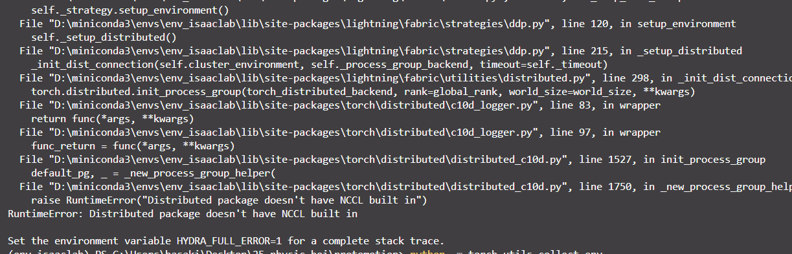

## Protomotion & MaskMimic
Protomotion: https://github.com/NVlabs/ProtoMotions.git
Maskmimic: https://arxiv.org/pdf/2409.14393v1

### 安装步骤
拉取项目：
```ps1
git submodule add https://github.com/NVlabs/ProtoMotions.git protomotion
git lfs install
git lfs fetch --all
```

IsaacLab：
已经安装过，跳过

install the Physical Animation package and its dependencies ：
```ps1
..\isaaclab\isaaclab.bat -p -m pip install -e .
..\isaaclab\isaaclab.bat -p -m pip install -r requirements_isaaclab.txt
..\isaaclab\isaaclab.bat -p -m pip install -e isaac_utils
..\isaaclab\isaaclab.bat -p -m pip install -e poselib
```

### 验证 checkpoint 效果

#### Masked Mimic
protomotion\data\pretrained_models\masked_mimic\smpl\README.md

```ps1
python protomotions\eval_agent.py +robot="smpl" +simulator="isaaclab" +motion_file="protomotion/data/motions/smpl_humanoid_walk.npy" +checkpoint="data/pretrained_models/masked_mimic/smpl/last.ckpt"
```
这个程序会调用 torch-lightning 随后会调用 Nv 的通信库 nccl 进行通讯，但是很显然我们windows上torch不支持nccl编译，所以我们下下来的wheel自然也是没有的。


https://pytorch-lightning.readthedocs.io/en/1.4.0/advanced/multi_gpu.html#select-torch-distributed-backend
在比较旧的 pl 中我们貌似可以通过设置 `PL_TORCH_DISTRIBUTED_BACKEND = "gloo"` 环境变量来制定gloo后端，但是在23年后的新版本好像已经移除了这个API。

https://github.com/Lightning-AI/pytorch-lightning/issues/18589
这里这个issue告诉我们可以通过直接修改 ddp 指定的后端从而指定 `gloo` 通信后端：
```python
from lightning.pytorch.strategies import DDPStrategy

trainer = Trainer(strategy=DDPStrategy(process_group_backend="gloo"), ...)
```
在protomotion里我们用了hydra的配置管理库，检查发现它在开始的时候调用了 `fabric.launch()` 然后调用了 hydra 的配置项，我们可以找到这个配置项位于 `protomotion\protomotions\config\base\hydra.yaml`, 可以发现它里面指定的策略就是 ddp： `lightning.fabric.strategies.DDPStrategy`。因此我们直接在我们原本的启动命令后面加一串hydra的配置指定即可：
```ps1
python protomotions\eval_agent.py +robot="smpl" +simulator="isaaclab" +motion_file="protomotion/data/motions/smpl_humanoid_walk.npy" +checkpoint="data/pretrained_models/masked_mimic/smpl/last.ckpt" +fabric.strategy.process_group_backend="gloo"
```

#### Motion Tracker
protomotion\data\pretrained_models\motion_tracker\smpl\README.md

```ps1
..\isaaclab\isaaclab.bat -p protomotions\eval_agent.py +robot="smpl" +simulator="isaaclab" +motion_file="protomotion/data/motions/smpl_humanoid_walk.npy" +checkpoint="{data/pretrained_models/motion_tracker/smpl/last.ckpt"
```