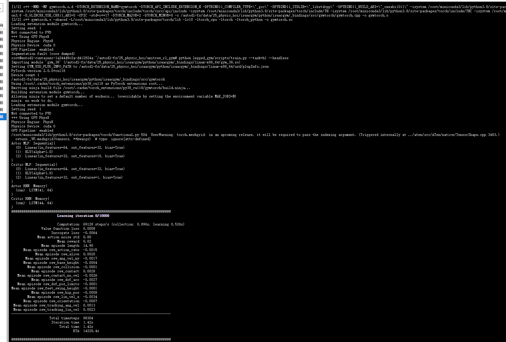

## Unitree RL Gym

### 安装

#### IsaacGym
https://developer.nvidia.com/isaac-gym/download

IsaacGym是一个**轻量级的、纯粹为并行强化学习（RL）设计**的物理仿真库，API 相对底层，速度较快但是渲染能力差。早在2024年Nvidia就已经停止对其的支持，并且开发重心全面转向Isaac Sim。

官方配置要求必须是 Ubuntu 18.04 / 20.04 才能正常安装， nv驱动版本需要高于 525， 因此我们只能从云平台租借服务器来运行。

实验配置：
- RTX 4090D
- Driver 550.67
- Ubuntu 20.04

Install IsaacGym
```bash
wget https://developer.nvidia.com/isaac-gym-preview-4
tar -xvzf isaac-gym-preview-4
pip install -e isaacgym/python
```

#### RSL RL 强化学习框架

```bash
git clone https://github.com/leggedrobotics/rsl_rl.git rsl_rl
cd rsl_rl && git checkout v1.0.2
pip install -e .
```

### 训练复现
由于云平台的linux系统没有图形界面支持，而IsaacGym 又不支持在windows上安装；因此我们在云平台上使用无头模式进行训练，随后迁移训练好的参数到windows上面验证训练结果。

#### 云平台训练
运行宇树H1机器人官方训练示例并保存训练日志：
```bash
python legged_gym/scripts/train.py --task=h1 --headless > ../assets/unitree_rl/unitree_training.log 2>&1
```

训练启动如图：


在训练 10k 个iteration后，我们取出平均eward最高（24.07）的一个ckpt（9500）来进行效果验证。

#### Windows验证（mujoco）
在安装Unitree_rl_gym的时候会给我们自动安装一些依赖库，包括 isaacgym, 这里我们只需要安装路径下的 legged_gym 库以及 mujoco 库即可，我们在执行 `pip install -e .` 时把 `setup.py` 中 `install_requires` 下的 `isaacgym` 删除即可。

官方示例:
运行以下命令会直接运行官方提供的位于 `deploy/pre_train/{robot}/motion.pt`的认模型；
```ps1
python deploy\deploy_mujoco\deploy_mujoco.py h1.yaml
```
<video controls src="MuJoCo _ h1 scene 2025-07-04 00-25-12.mp4" title="Title"></video>

训练复现结果：
我们训练好模型保存于`src\unitree_rl\logs\h1\Jul03_20-09-01_\model_9500.pt`，只需将其换到 yaml 配置文件中 `policy_path` 即可。

<video controls src="MuJoCo _ h1 scene 2025-07-04 00-29-54.mp4" title="Title"></video>

可以看到我们训练 10k 轮的结果与官方提供的ckpt的表现基本上是一致的。

### 奖励函数解析
https://zhuanlan.zhihu.com/p/30141963553

代码位置：
https://github.com/unitreerobotics/unitree_rl_gym/blob/757b05158058a2a8005810c2bb2e1e8667cf3f17/legged_gym/envs/base/legged_robot.py#L163

https://github.com/unitreerobotics/unitree_rl_gym/blob/757b05158058a2a8005810c2bb2e1e8667cf3f17/legged_gym/envs/h1/h1_env.py#L98